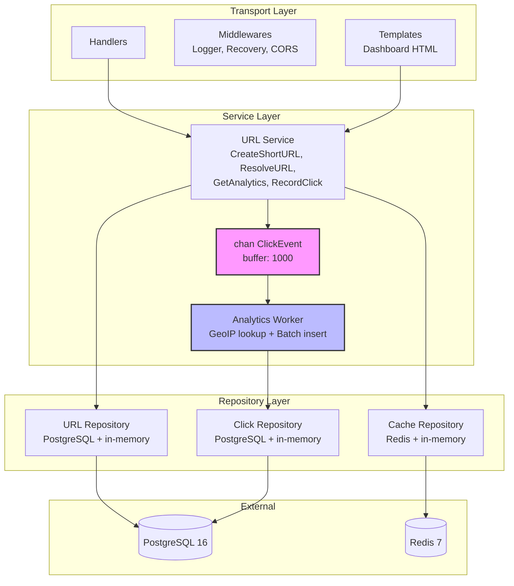
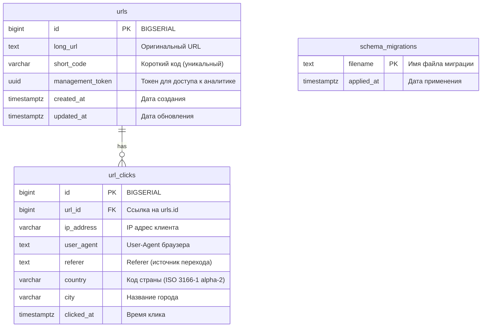
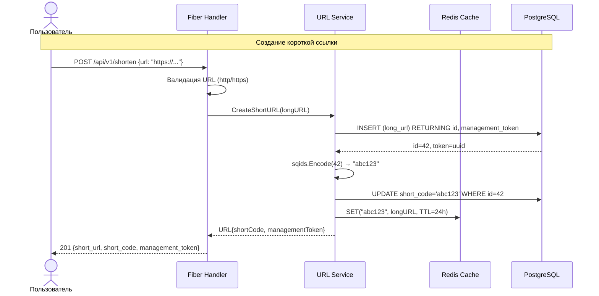
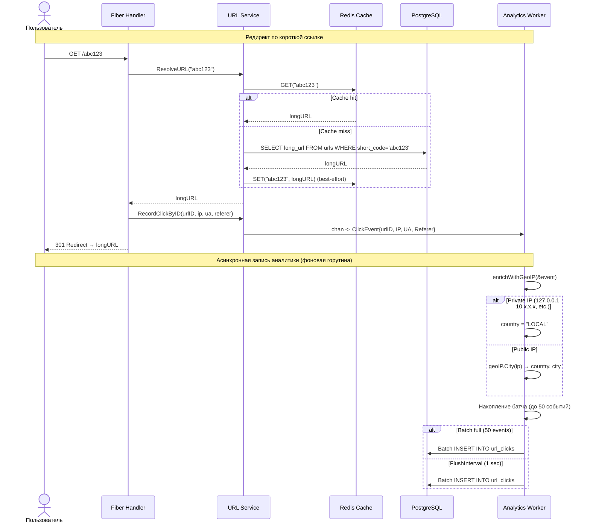
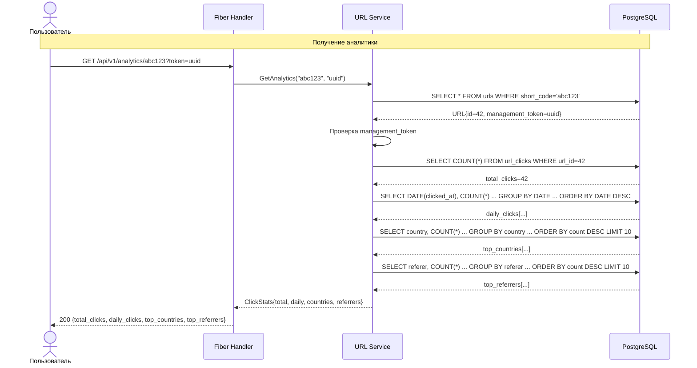
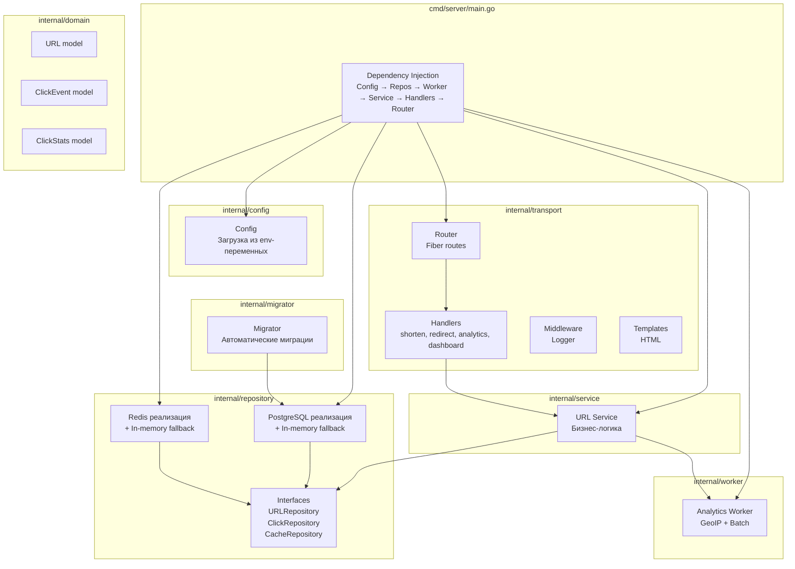
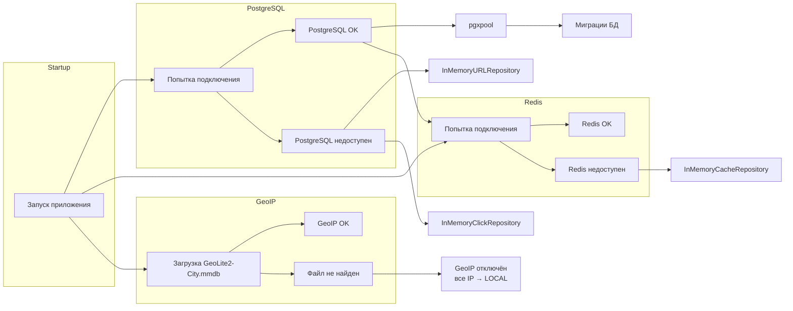
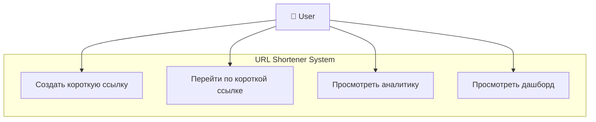
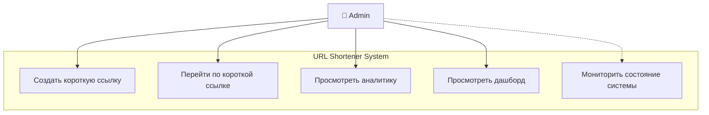
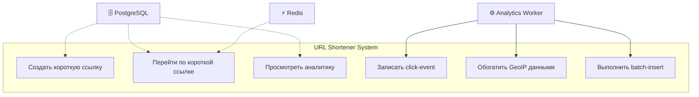

# Архитектура проекта

## Общая архитектура (Big Picture)

```
┌─────────────┐     ┌──────────────┐     ┌────────────┐
│   Клиент    │────▶│  Fiber HTTP  │────▶│  Service   │
│ (браузер/   │     │   Server     │     │  (бизнес-  │
│  curl/      │◀────│  (handlers)  │◀────│   логика)  │
│  клиент)    │     └──────────────┘     └──────┬─────┘
└─────────────┘                                 │
                                                 │
                    ┌────────────────────────────┼────────────────────┐
                    │                            │                    │
                    ▼                            ▼                    ▼
           ┌──────────────┐            ┌──────────────┐     ┌──────────────┐
           │  PostgreSQL  │            │    Redis     │     │  Analytics   │
           │  (основное   │            │   (кэш)      │     │   Worker     │
           │  хранилище)  │            │              │     │  (GeoIP +    │
           └──────────────┘            └──────────────┘     │  Batch)      │
                                                            └──────┬───────┘
                                                                   │
                                                                   ▼
                                                           ┌──────────────┐
                                                           │  PostgreSQL  │
                                                           │  (click_     │
                                                           │   events)    │
                                                           └──────────────┘
```

## Диаграмма компонентов и зависимостей



## Схема базы данных



### Таблица `urls`

```sql
CREATE TABLE urls (
    id               BIGSERIAL    PRIMARY KEY,
    long_url         TEXT         NOT NULL,
    short_code       VARCHAR(10)  UNIQUE,
    management_token UUID         NOT NULL DEFAULT gen_random_uuid(),
    created_at       TIMESTAMPTZ  NOT NULL DEFAULT NOW(),
    updated_at       TIMESTAMPTZ  NOT NULL DEFAULT NOW()
);

CREATE INDEX idx_urls_short_code ON urls(short_code);
```

### Таблица `url_clicks`

```sql
CREATE TABLE url_clicks (
    id          BIGSERIAL    PRIMARY KEY,
    url_id      BIGINT       NOT NULL REFERENCES urls(id) ON DELETE CASCADE,
    ip_address  VARCHAR(45),
    user_agent  TEXT,
    referer     TEXT,
    country     VARCHAR(16),  -- ISO 3166-1 alpha-2 (RU, US, DE...) или 'LOCAL'
    city        VARCHAR(100),
    clicked_at  TIMESTAMPTZ  NOT NULL DEFAULT NOW()
);

CREATE INDEX idx_url_clicks_url_id ON url_clicks(url_id);
CREATE INDEX idx_url_clicks_clicked_at ON url_clicks(clicked_at);
```

### Таблица `schema_migrations`

```sql
CREATE TABLE schema_migrations (
    filename    TEXT         PRIMARY KEY,
    applied_at  TIMESTAMPTZ  NOT NULL DEFAULT NOW()
);
```

## Диаграмма последовательности: создание ссылки



## Диаграмма последовательности: редирект + аналитика



## Диаграмма последовательности: получение аналитики



## Поток данных: создание короткой ссылки

```
Client → POST /api/v1/shorten { "url": "https://..." }
  → Handler валидирует URL (схема http/https)
  → Service.CreateShortURL()
    → Repository.Insert(longURL) → получает id + management_token
    → sqids.Encode(id) → shortCode
    → Repository.UpdateShortCode(id, shortCode)
    → CacheRepository.Set(shortCode, longURL, TTL=24h)
  ← Response 201 { "short_url": "http://localhost:8080/abc123", "management_token": "uuid" }
```

## Поток данных: редирект по короткой ссылке

```
Client → GET /abc123
  → Handler извлекает shortCode из пути
  → Service.ResolveURL(shortCode)
    → CacheRepository.Get(shortCode) → если есть, сразу отдаём
    → Repository.FindByShortCode(shortCode) → longURL
    → CacheRepository.Set(shortCode, longURL) — кэшируем (best-effort)
  → Отправляем ClickEvent в канал (асинхронно, не блокируя ответ)
  → Редирект 301 на longURL
```

## Поток данных: асинхронная запись аналитики

```
ClickEvent { URLID, IP, UserAgent, Referer, Timestamp }
  → отправляется в buffered chan ClickEvent (capacity 1000)
  → AnalyticsWorker (отдельная горутина) читает из канала
  → enrichWithGeoIP(&event):
    - Если IP пустой → country = "LOCAL"
    - Если IP приватный (127.0.0.1, 10.x.x.x, 172.16-31.x.x, 192.168.x.x) → country = "LOCAL"
    - Если GeoIP база загружена → geoIP.City(ip) → country + city
  → Накопление батча (до 50 событий)
  → При достижении BatchSize (50) или по таймеру (1 сек):
    → BatchInsert в url_clicks (pgx.Batch)
```

## Схема слоёв приложения



## Обработка ошибок и fallback-механизмы



## Use Case диаграммы

### Use Case: Пользователь (User)



| Актор | Прецедент (Use Case) | Описание |
|-------|---------------------|----------|
| 👤 User | Создать короткую ссылку | Отправляет длинный URL через `POST /api/v1/shorten` и получает короткий код + management_token |
| 👤 User | Перейти по короткой ссылке | Открывает `GET /{short_code}` в браузере — происходит редирект на оригинальный URL |
| 👤 User | Просмотреть аналитику | Запрашивает `GET /api/v1/analytics/{short_code}?token={uuid}` — получает статистику переходов |
| 👤 User | Просмотреть дашборд | Открывает `GET /dashboard/{short_code}?token={uuid}` — визуальная HTML-панель с графиками |

### Use Case: Администратор (Admin)



| Актор | Прецедент (Use Case) | Описание |
|-------|---------------------|----------|
| 👤 Admin | Создать короткую ссылку | Аналогично User |
| 👤 Admin | Перейти по короткой ссылке | Аналогично User |
| 👤 Admin | Просмотреть аналитику | Аналогично User |
| 👤 Admin | Просмотреть дашборд | Аналогично User |
| 👤 Admin | Мониторить состояние системы | *(опционально)* Проверяет логи, метрики, состояние БД и Redis через внешние инструменты |

### Use Case: Системные акторы (System Actors)



| Актор | Прецедент (Use Case) | Описание |
|-------|---------------------|----------|
| ⚙️ Analytics Worker | Записать click-event | Получает событие из буферизированного канала |
| ⚙️ Analytics Worker | Обогатить GeoIP данными | Определяет страну и город по IP-адресу |
| ⚙️ Analytics Worker | Выполнить batch-insert | Групповая вставка накопленных событий в `url_clicks` |
| 🗄️ PostgreSQL | *(поддержка)* | Хранит ссылки и клики, участвует в запросах |
| ⚡ Redis | *(поддержка)* | Кэширует расшифрованные короткие ссылки |

## Ключевые архитектурные решения

### 1. Луковая архитектура (Layered Architecture)

Код разделён на слои: `handlers → service → repository`. Каждый слой зависит только от нижележащего через интерфейсы. Это обеспечивает:

- **Тестируемость** — каждый слой можно тестировать изолированно с моками
- **Гибкость** — замена реализации (например, PostgreSQL → in-memory) без изменения вызывающего кода
- **Чёткое разделение ответственности**

### 2. Асинхронная аналитика через каналы

Click-события отправляются в буферизированный канал (capacity 1000) и обрабатываются фоновой горутиной. Это гарантирует:

- **Низкую задержку редиректа** — запись в БД не блокирует ответ клиенту
- **Graceful degradation** — при переполнении канала события дропаются, но сервис продолжает работу
- **Batch-эффективность** — группировка вставок снижает нагрузку на БД

### 3. In-memory fallback

При недоступности PostgreSQL или Redis сервис автоматически переключается на in-memory реализации. Это позволяет:

- Запускать сервис без внешних зависимостей для разработки
- Сохранять работоспособность при сбоях инфраструктуры
- Использовать в тестовых окружениях без БД

### 4. Sqids для генерации кодов

Вместо случайных строк или хэшей используется [Sqids](https://github.com/sqids/sqids-go) (Hashids):

- **Без коллизий** — код детерминированно вычисляется из числового ID
- **Короткие коды** — минимальная длина 6 символов
- **Без ненормативной лексики** — Sqids гарантирует читаемые коды

### 5. Graceful Shutdown

При получении сигнала SIGINT/SIGTERM:

1. Сервер перестаёт принимать новые запросы
2. Analytics Worker дообрабатывает оставшиеся события в канале
3. Все накопленные батчи сбрасываются в БД
4. Ресурсы (GeoIP reader, пулы соединений) корректно закрываются