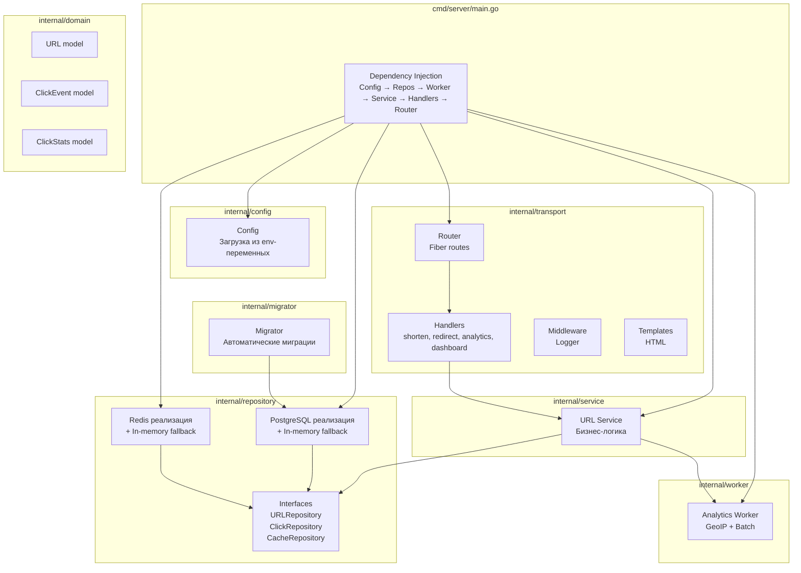
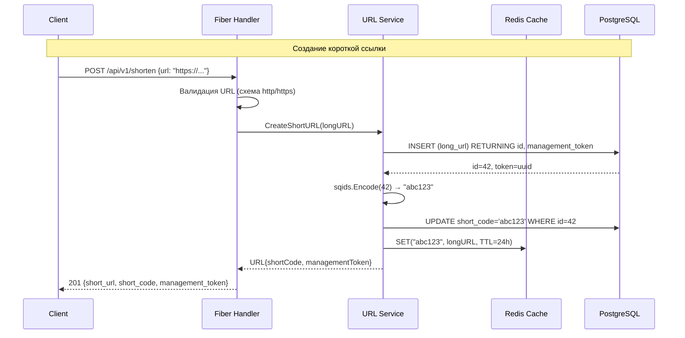
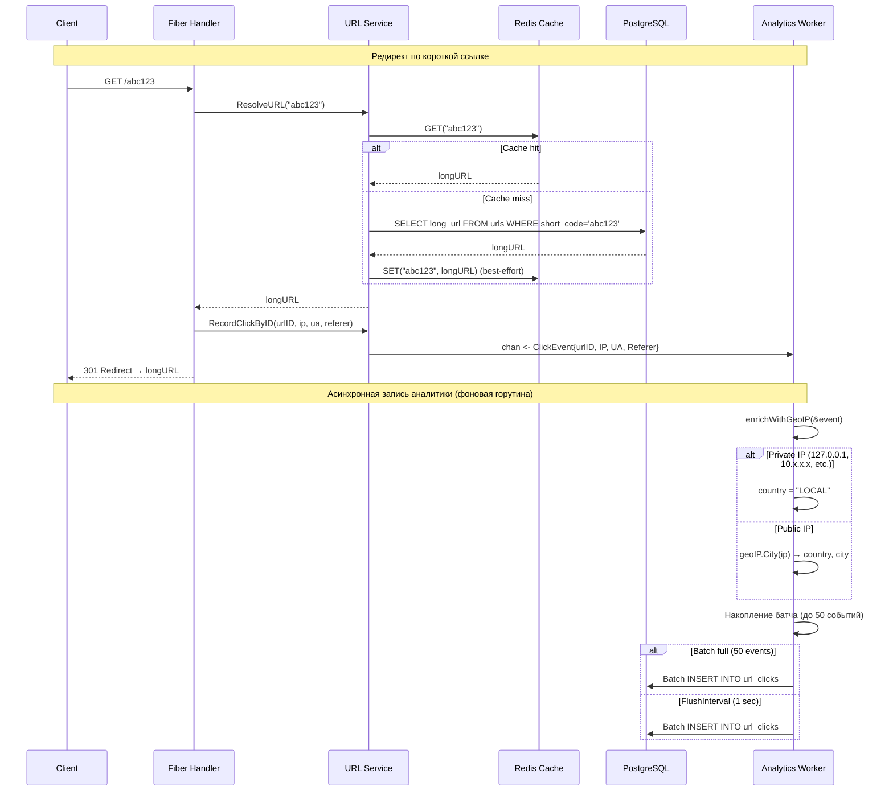
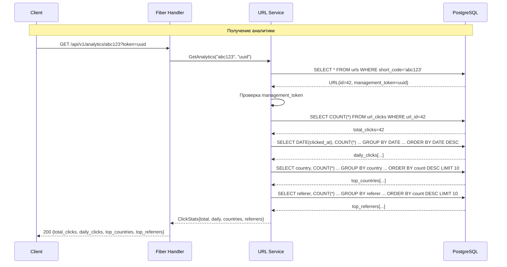
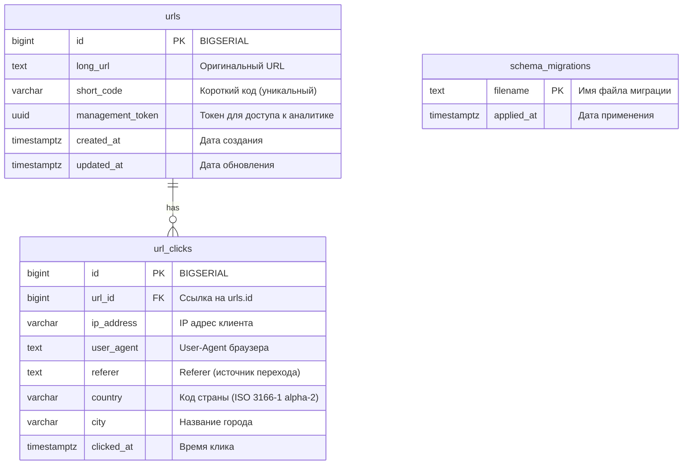
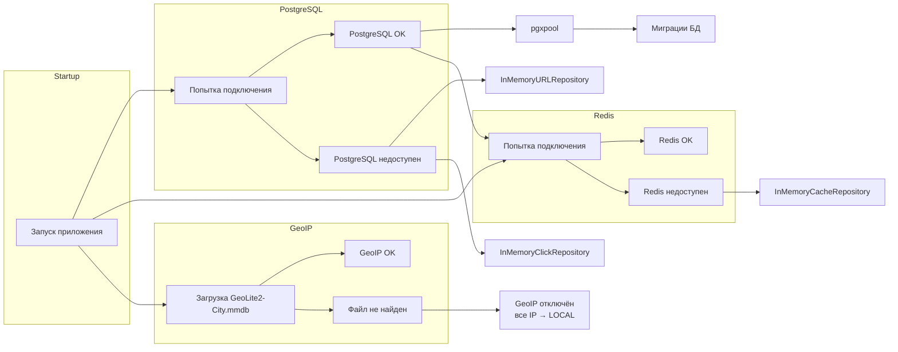
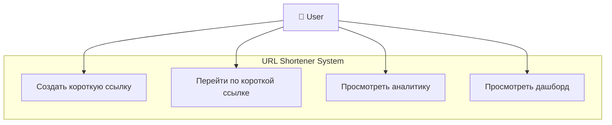
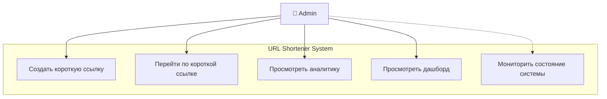
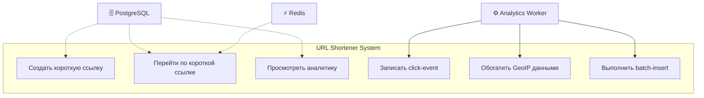

# 2. Проектная часть

## 2.1 Архитектура разрабатываемой системы

В результате анализа предметной области была спроектирована архитектура высокопроизводительного сервиса сокращения ссылок с аналитикой, предназначенного для создания коротких ссылок и сбора статистики переходов. Основной задачей системы является обеспечение быстрого редиректа по коротким ссылкам с одновременным сбором аналитических данных: IP-адресов, User-Agent, Referer-заголовков и геолокации.

При проектировании системы особое внимание уделялось разделению ответственности между компонентами, асинхронной обработке аналитики (чтобы не влиять на скорость редиректа), устойчивости к отказам внешних зависимостей и возможности независимого развития отдельных частей системы. В качестве архитектурного подхода была выбрана луковая архитектура (Layered Architecture) с клиент-серверной моделью взаимодействия.

Разрабатываемая система состоит из следующих основных компонентов:

1. **Fiber HTTP-сервер** — точка входа всех запросов, маршрутизация, валидация;
2. **Сервисный слой (Service Layer)** — бизнес-логика: создание ссылок, редирект, аналитика;
3. **Репозитории (Repository Layer)** — PostgreSQL (основное хранилище), Redis (кэш), in-memory fallback;
4. **Analytics Worker** — фоновая горутина для асинхронной обработки кликов с GeoIP-обогащением;
5. **PostgreSQL** — хранение ссылок и событий кликов;
6. **Redis** — кэширование расшифрованных коротких ссылок;
7. **HTML-шаблоны** — дашборд аналитики и главная страница.

Центральным компонентом системы является backend-сервис, реализованный на языке Go с использованием фреймворка Fiber. Backend предоставляет REST API для взаимодействия с внешними клиентами (браузеры, curl, мобильные приложения). В backend-сервисе реализуется основная логика сокращения ссылок, редиректа, сбора аналитики и управления доступом к статистике через management token.

Для хранения данных используется PostgreSQL. В рамках проекта PostgreSQL выполняет функции основного реляционного хранилища и используется для хранения URL-записей, событий кликов и метаданных миграций. Выбор PostgreSQL обусловлен надёжностью, поддержкой транзакций, возможностью выполнения аналитических запросов с группировкой и агрегацией, а также встроенной поддержкой UUID.

Для кэширования используется Redis. Backend-сервис кэширует расшифрованные короткие ссылки после первого обращения к базе данных, что позволяет значительно ускорить последующие редиректы. Выбор Redis обусловлен высокой производительностью in-memory хранения, простотой интеграции и автоматическим удалением устаревших записей через TTL.

Для геолокации используется MaxMind GeoLite2. Analytics Worker обогащает каждое событие клика информацией о стране и городе по IP-адресу. Приватные и локальные IP-адреса маркируются как LOCAL. При отсутствии GeoIP-базы все IP считаются неопределёнными.

Дополнительно в системе реализован HTML-дашборд, предназначенный для визуального просмотра аналитики по короткой ссылке: график ежедневных переходов, таблица стран и источников переходов.

## 2.2 Общая схема архитектуры системы

Общая архитектура разрабатываемой системы представлена на рисунке 2.1.

```
┌─────────────┐     ┌──────────────┐     ┌────────────┐
│   Клиент    │────▶│  Fiber HTTP  │────▶│  Service   │
│ (браузер/   │     │   Server     │     │  (бизнес-  │
│  curl/      │◀────│  (handlers)  │◀────│   логика)  │
│  клиент)    │     └──────────────┘     └──────┬─────┘
└─────────────┘                                 │
                                                 │
                    ┌────────────────────────────┼────────────────────┐
                    │                            │                    │
                    ▼                            ▼                    ▼
           ┌──────────────┐            ┌──────────────┐     ┌──────────────┐
           │  PostgreSQL  │            │    Redis     │     │  Analytics   │
           │  (основное   │            │   (кэш)      │     │   Worker     │
           │  хранилище)  │            │              │     │  (GeoIP +    │
           └──────────────┘            └──────────────┘     │  Batch)      │
                                                            └──────┬───────┘
                                                                   │
                                                                   ▼
                                                           ┌──────────────┐
                                                           │  PostgreSQL  │
                                                           │  (click_     │
                                                           │   events)    │
                                                           └──────────────┘
```

Рисунок 2.1 – Общая архитектура системы

На представленной схеме Fiber HTTP-сервер выступает центральным узлом системы, обеспечивающим взаимодействие между клиентами, сервисным слоем, хранилищами и фоновым обработчиком аналитики. Клиент отправляет HTTP-запросы на сервер, который делегирует обработку сервисному слою. Сервисный слой, в свою очередь, взаимодействует с репозиториями (PostgreSQL и Redis) для чтения и записи данных. Аналитические события отправляются в буферизированный канал и асинхронно обрабатываются Analytics Worker, который выполняет GeoIP-обогащение и пакетную вставку в PostgreSQL.

## 2.3 Архитектура backend-сервиса

Backend-сервис реализован по модульному принципу с использованием луковой архитектуры. Основная логика системы разделена на отдельные слои и компоненты, отвечающие за различные аспекты работы приложения.

Архитектура backend-сервиса включает:

1. **Транспортный слой (Transport Layer)** — HTTP-роутеры, хендлеры, middleware;
2. **Сервисный слой (Service Layer)** — бизнес-логика приложения;
3. **Слой репозиториев (Repository Layer)** — интерфейсы и реализации доступа к данным;
4. **Слой доменных моделей (Domain Layer)** — модели данных;
5. **Фоновые обработчики (Workers)** — Analytics Worker;
6. **HTML-шаблоны** — дашборд аналитики и главная страница;
7. **Мигратор (Migrator)** — автоматическое применение миграций БД.

Разделение системы на независимые слои и модули упрощает сопровождение проекта, тестирование и дальнейшее расширение функциональности. Каждый слой зависит только от нижележащего через интерфейсы, что обеспечивает слабую связанность и высокую тестируемость.

Структура backend-приложения представлена на рисунке 2.2.



Рисунок 2.2 – Структура backend-приложения

Модуль `internal/transport` содержит HTTP-роутеры Fiber и реализует REST API системы. В модуле `internal/service` расположена бизнес-логика приложения: создание коротких ссылок, редирект, запись аналитики и получение статистики. Модуль `internal/repository` отвечает за взаимодействие с PostgreSQL и Redis, а также предоставляет in-memory реализации для разработки и тестирования. В каталоге `internal/domain` располагаются модели данных. Модуль `internal/worker` содержит Analytics Worker — фоновую горутину для асинхронной обработки кликов. Модуль `internal/migrator` отвечает за автоматическое применение миграций базы данных при запуске.

## 2.4 Диаграмма процесса создания короткой ссылки

Процесс создания короткой ссылки является одним из ключевых сценариев использования системы. Пользователь отправляет длинный URL, система сохраняет его в базе данных, генерирует уникальный короткий код с помощью Sqids и возвращает результат клиенту.

Диаграмма последовательности создания короткой ссылки представлена на рисунке 2.3.



Рисунок 2.3 – Диаграмма последовательности создания короткой ссылки

В данной схеме backend-сервис выполняет следующие шаги:

1. **Валидация** — хендлер проверяет, что переданный URL имеет схему `http` или `https`;
2. **Сохранение в БД** — сервис вставляет длинный URL в таблицу `urls` и получает обратно числовой ID и UUID management_token;
3. **Генерация кода** — сервис кодирует числовой ID в короткий код с помощью библиотеки Sqids (например, `42 → "abc123"`);
4. **Обновление записи** — сервис сохраняет сгенерированный короткий код в БД;
5. **Кэширование** — сервис помещает пару `shortCode → longURL` в Redis с TTL 24 часа;
6. **Ответ клиенту** — клиент получает JSON с короткой ссылкой, кодом и management_token.

## 2.5 Диаграмма процесса редиректа и асинхронной записи аналитики

Одним из ключевых процессов системы является редирект по короткой ссылке с одновременным сбором аналитических данных. После успешного разрешения короткого кода в оригинальный URL система асинхронно записывает событие клика в буферизированный канал, не блокируя ответ клиенту.

Диаграмма последовательности редиректа и аналитики представлена на рисунке 2.4.



Рисунок 2.4 – Диаграмма последовательности редиректа и асинхронной записи аналитики

Данная последовательность демонстрирует взаимодействие между всеми основными компонентами системы в процессе редиректа:

1. **Разрешение короткого кода** — сервис проверяет кэш Redis; при промахе выполняет запрос к PostgreSQL;
2. **Асинхронная запись клика** — хендлер клонирует строки из Fiber/FastHTTP (User-Agent, Referer, IP) и отправляет событие в буферизированный канал;
3. **Мгновенный редирект** — клиенту возвращается 301 Redirect без ожидания записи в БД;
4. **Фоновая обработка** — Analytics Worker читает события из канала, обогащает их GeoIP-данными и накапливает в батч;
5. **Пакетная вставка** — при накоплении 50 событий или по истечении 1 секунды батч вставляется в таблицу `url_clicks`.

## 2.6 Диаграмма процесса получения аналитики

Для просмотра статистики переходов пользователь отправляет GET-запрос с коротким кодом и management_token. Система проверяет право доступа и выполняет несколько аналитических запросов к PostgreSQL.

Диаграмма последовательности получения аналитики представлена на рисунке 2.5.



Рисунок 2.5 – Диаграмма последовательности получения аналитики

Процесс получения аналитики включает:

1. **Проверка токена** — сервис находит URL по короткому коду и сверяет management_token;
2. **Общее количество кликов** — `COUNT(*)` по `url_id`;
3. **Ежедневная статистика** — группировка кликов по датам с сортировкой по убыванию;
4. **Топ стран** — группировка по полю `country` с лимитом 10 записей;
5. **Топ источников** — группировка по полю `referer` с лимитом 10 записей.

## 2.7 Структура базы данных PostgreSQL

В разработанной системе хранение данных организовано с использованием PostgreSQL. Данные приложения разделены на несколько логических сущностей: URL-записи, события кликов и метаданные миграций.

Структура базы данных представлена на рисунке 2.6.



Рисунок 2.6 – Структура базы данных PostgreSQL

### Таблица `urls`

Таблица `urls` является основной сущностью системы и хранит информацию о сокращённых ссылках.

```sql
CREATE TABLE urls (
    id               BIGSERIAL    PRIMARY KEY,
    long_url         TEXT         NOT NULL,
    short_code       VARCHAR(10)  UNIQUE,
    management_token UUID         NOT NULL DEFAULT gen_random_uuid(),
    created_at       TIMESTAMPTZ  NOT NULL DEFAULT NOW(),
    updated_at       TIMESTAMPTZ  NOT NULL DEFAULT NOW()
);

CREATE INDEX idx_urls_short_code ON urls(short_code);
```

Структура записи в таблице `urls`:

- **id** — числовой идентификатор, генерируется автоматически (BIGSERIAL). Используется для генерации короткого кода через Sqids;
- **long_url** — оригинальный длинный URL, который необходимо сократить;
- **short_code** — уникальный короткий код (до 10 символов), генерируется после вставки записи;
- **management_token** — UUIDv4-токен для доступа к аналитике. Генерируется автоматически при вставке;
- **created_at** — временная метка создания записи;
- **updated_at** — временная метка последнего обновления записи.

Индекс по полю `short_code` обеспечивает быстрый поиск при редиректе.

### Таблица `url_clicks`

Таблица `url_clicks` хранит все события переходов по коротким ссылкам. Каждая запись соответствует одному клику.

```sql
CREATE TABLE url_clicks (
    id          BIGSERIAL    PRIMARY KEY,
    url_id      BIGINT       NOT NULL REFERENCES urls(id) ON DELETE CASCADE,
    ip_address  VARCHAR(45),
    user_agent  TEXT,
    referer     TEXT,
    country     VARCHAR(16),  -- ISO 3166-1 alpha-2 (RU, US, DE...) или 'LOCAL'
    city        VARCHAR(100),
    clicked_at  TIMESTAMPTZ  NOT NULL DEFAULT NOW()
);

CREATE INDEX idx_url_clicks_url_id ON url_clicks(url_id);
CREATE INDEX idx_url_clicks_clicked_at ON url_clicks(clicked_at);
```

Структура записи в таблице `url_clicks`:

- **id** — числовой идентификатор события;
- **url_id** — внешний ключ на таблицу `urls`. `ON DELETE CASCADE` обеспечивает автоматическое удаление кликов при удалении ссылки;
- **ip_address** — IP-адрес клиента (IPv4 или IPv6, до 45 символов);
- **user_agent** — строка User-Agent браузера или клиента;
- **referer** — HTTP-заголовок Referer, указывающий источник перехода;
- **country** — код страны в формате ISO 3166-1 alpha-2 (RU, US, DE и т.д.) или `LOCAL` для приватных IP;
- **city** — название города на английском языке;
- **clicked_at** — временная метка клика.

Индексы по полям `url_id` и `clicked_at` обеспечивают быструю агрегацию аналитических запросов.

### Таблица `schema_migrations`

Таблица `schema_migrations` используется встроенным мигратором для отслеживания применённых миграций.

```sql
CREATE TABLE schema_migrations (
    filename    TEXT         PRIMARY KEY,
    applied_at  TIMESTAMPTZ  NOT NULL DEFAULT NOW()
);
```

## 2.8 Обработка ошибок и fallback-механизмы

Система спроектирована с учётом устойчивости к отказам внешних зависимостей. При недоступности PostgreSQL или Redis сервис автоматически переключается на in-memory реализации репозиториев, что позволяет сохранять базовую работоспособность.

Схема fallback-механизмов представлена на рисунке 2.7.



Рисунок 2.7 – Схема fallback-механизмов

### Fallback для PostgreSQL

При запуске сервис пытается подключиться к PostgreSQL. Если подключение не удалось (например, БД не запущена или недоступна по сети), сервис автоматически переключается на `InMemoryURLRepository` и `InMemoryClickRepository`. Эти реализации хранят данные в оперативной памяти с использованием мьютексов для потокобезопасности. При переключении на in-memory режим миграции БД не выполняются, а все данные теряются при перезапуске сервиса.

### Fallback для Redis

При недоступности Redis сервис переключается на `InMemoryCacheRepository`, который реализует интерфейс кэширования с использованием `sync.Map`. In-memory кэш не имеет TTL и хранит данные до перезапуска сервиса.

### Fallback для GeoIP

При отсутствии файла GeoLite2-City.mmdb или при ошибке его загрузки GeoIP-обогащение отключается. В этом случае все клики сохраняются без указания страны и города. Analytics Worker продолжает работать в штатном режиме, пропуская шаг геолокации.

## 2.9 Use Case диаграммы

### Use Case: Пользователь (User)



Рисунок 2.8 – Use Case диаграмма для пользователя

| Актор | Прецедент (Use Case) | Описание |
|-------|---------------------|----------|
| 👤 User | Создать короткую ссылку | Отправляет длинный URL через `POST /api/v1/shorten` и получает короткий код + management_token |
| 👤 User | Перейти по короткой ссылке | Открывает `GET /{short_code}` в браузере — происходит редирект на оригинальный URL |
| 👤 User | Просмотреть аналитику | Запрашивает `GET /api/v1/analytics/{short_code}?token={uuid}` — получает статистику переходов |
| 👤 User | Просмотреть дашборд | Открывает `GET /dashboard/{short_code}?token={uuid}` — визуальная HTML-панель с графиками |

### Use Case: Администратор (Admin)



Рисунок 2.9 – Use Case диаграмма для администратора

| Актор | Прецедент (Use Case) | Описание |
|-------|---------------------|----------|
| 👤 Admin | Создать короткую ссылку | Аналогично User |
| 👤 Admin | Перейти по короткой ссылке | Аналогично User |
| 👤 Admin | Просмотреть аналитику | Аналогично User |
| 👤 Admin | Просмотреть дашборд | Аналогично User |
| 👤 Admin | Мониторить состояние системы | *(опционально)* Проверяет логи, метрики, состояние БД и Redis через внешние инструменты |

### Use Case: Системные акторы (System Actors)



Рисунок 2.10 – Use Case диаграмма для системных акторов

| Актор | Прецедент (Use Case) | Описание |
|-------|---------------------|----------|
| ⚙️ Analytics Worker | Записать click-event | Получает событие из буферизированного канала |
| ⚙️ Analytics Worker | Обогатить GeoIP данными | Определяет страну и город по IP-адресу |
| ⚙️ Analytics Worker | Выполнить batch-insert | Групповая вставка накопленных событий в `url_clicks` |
| 🗄️ PostgreSQL | *(поддержка)* | Хранит ссылки и клики, участвует в запросах |
| ⚡ Redis | *(поддержка)* | Кэширует расшифрованные короткие ссылки |

## 2.10 Ключевые архитектурные решения

### 1. Луковая архитектура (Layered Architecture)

Код разделён на слои: `handlers → service → repository`. Каждый слой зависит только от нижележащего через интерфейсы. Это обеспечивает:

- **Тестируемость** — каждый слой можно тестировать изолированно с in-memory реализациями;
- **Гибкость** — замена реализации (например, PostgreSQL → in-memory) без изменения вызывающего кода;
- **Чёткое разделение ответственности** — хендлеры отвечают только за HTTP, сервисы — за бизнес-логику, репозитории — за хранение данных.

### 2. Асинхронная аналитика через каналы

Click-события отправляются в буферизированный канал (capacity 1000) и обрабатываются фоновой горутиной. Это гарантирует:

- **Низкую задержку редиректа** — запись в БД не блокирует ответ клиенту;
- **Graceful degradation** — при переполнении канала события дропаются, но сервис продолжает работу;
- **Batch-эффективность** — группировка вставок (до 50 событий или 1 секунда) снижает нагрузку на БД.

### 3. In-memory fallback

При недоступности PostgreSQL или Redis сервис автоматически переключается на in-memory реализации. Это позволяет:

- Запускать сервис без внешних зависимостей для разработки и тестирования;
- Сохранять работоспособность при сбоях инфраструктуры;
- Использовать в CI-окружениях без БД.

### 4. Sqids для генерации кодов

Вместо случайных строк или хэшей используется библиотека Sqids (ранее Hashids):

- **Без коллизий** — код детерминированно вычисляется из числового ID;
- **Короткие коды** — минимальная длина 6 символов;
- **Без ненормативной лексики** — Sqids гарантирует читаемые коды.

### 5. Zero-copy string interning защита

Fiber под капотом использует FastHTTP, который не копирует строки при парсинге HTTP-заголовков — строки указывают на внутренний буфер. При обработке следующего запроса буфер переиспользуется, и старые строки "меняются". Для защиты асинхронной аналитики все строки (User-Agent, Referer, IP-адрес) клонируются через `strings.Clone()` перед отправкой в канал.

### 6. Graceful Shutdown

При получении сигнала SIGINT/SIGTERM:

1. Сервер перестаёт принимать новые запросы;
2. Analytics Worker дообрабатывает оставшиеся события в канале;
3. Все накопленные батчи сбрасываются в БД;
4. Ресурсы (GeoIP reader, пулы соединений) корректно закрываются.

## 2.11 Система контроля версий Git

В ходе разработки сервиса сокращения ссылок велась активная работа с системой контроля версий Git. Управление исходным кодом осуществлялось по методологии Git flow, предполагающей выделение нескольких постоянных и временных веток с чётко определёнными ролями. Такой подход обеспечил упорядоченную историю изменений, возможность изолированной доработки отдельных компонентов и безопасное внесение исправлений без риска нарушить работу остальной части системы.

В таблице 2.1 приведено описание веток, использовавшихся в рамках проекта.

Таблица 2.1 – Ветки репозитория

| Ветка | Назначение |
|-------|-----------|
| main | Стабильная версия проекта, готовая к сдаче. Все изменения попадают в main после завершения разработки очередной функциональности |
| feature/transport | Разработка транспортного слоя: HTTP-роутеры Fiber, хендлеры, middleware |
| feature/repository | Реализация слоя репозиториев: PostgreSQL, Redis, in-memory fallback |
| feature/analytics | Создание Analytics Worker: GeoIP-обогащение, batch-вставка, каналы |
| feature/dashboard | HTML-дашборд аналитики с графиками и таблицами |
| feature/ci-cd | Настройка CI/CD: golangci-lint, CodeQL, Docker, Makefile |
| fix/geoip | Исправление обработки GeoIP: приватные IP, LOCAL-маркировка, fallback |
| fix/fasthttp-strings | Устранение data race в асинхронной аналитике (zero-copy string interning) |
| fix/docker | Исправление ошибок Docker Compose: переменные окружения, миграции |
| docs | Документирование: README, OpenAPI, архитектура, тестирование |

Каждая функциональная возможность разрабатывалась в отдельной ветке `feature/*`, после чего изменения вливались в `main`. Исправления ошибок выполнялись в ветках `fix/*` с последующим слиянием. Документация велась в ветке `docs`. Такой подход позволил изолировать разработку разных компонентов (транспорт, репозитории, аналитика, дашборд) и избежать конфликтов при параллельной работе над ними.

При работе с Git применялись семантические коммиты — единый формат, обеспечивающий читаемость истории изменений и автоматическую генерацию changelog. Формат семантического коммита:

```
<type>(<scope>): <описание>
```

Типы коммитов, использовавшиеся в проекте:

- **feat** — добавление новой функциональности (например, `feat: add analytics worker with GeoIP`);
- **fix** — исправление ошибки (например, `fix: resolve Docker Compose runtime errors`);
- **test** — добавление или изменение тестов (например, `test: GeoIP по странам, e2e-аналитика`);
- **docs** — работа с документацией (например, `docs: add full project documentation`);
- **chore** — служебные изменения: CI, зависимости, конфигурация (например, `chore: init go module and core directory structure`);
- **refactor** — рефакторинг кода без изменения функциональности.

Область изменений (scope) указывала на конкретный компонент системы: `transport`, `repository`, `analytics`, `dashboard`, `ci`, `docker`, `geoip`.

Ниже приведены примеры реальных семантических коммитов из истории разработки проекта:

```
feat: implement transport layer with Fiber and repository layer with pgx/Redis
feat: add analytics worker with GeoIP, click tracking, and analytics API
feat: add dashboard, CI/CD, SAST, benchmarks and E2E tests
feat: auto-apply DB migrations on startup via built-in migrator
fix: clone Fiber/FastHTTP strings to prevent data race in async analytics
fix: resolve Docker Compose runtime errors
fix(ci): update golangci-lint to v2.12.2 and CodeQL to v4
test: GeoIP по странам, e2e-аналитика и gofmt migrator
docs: add README and OpenAPI specification
docs: add testing documentation and references list
chore: init go module and core directory structure
chore: configure golangci-lint v2.12.2 with 75 active linters
```

Разработка велась в локальном репозитории без публикации на удалённый хостинг (GitHub). Все операции слияния веток, разрешения конфликтов и управления версиями выполнялись локально. Такой подход позволил полностью контролировать процесс разработки и обеспечить целостность истории изменений. Всего за время работы над проектом было выполнено 20 коммитов, охватывающих инициализацию модуля, реализацию транспортного слоя, репозиториев, аналитики, дашборда, CI/CD, исправление ошибок и документирование.