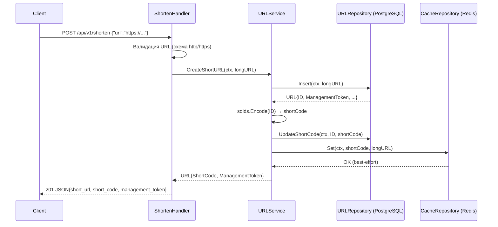
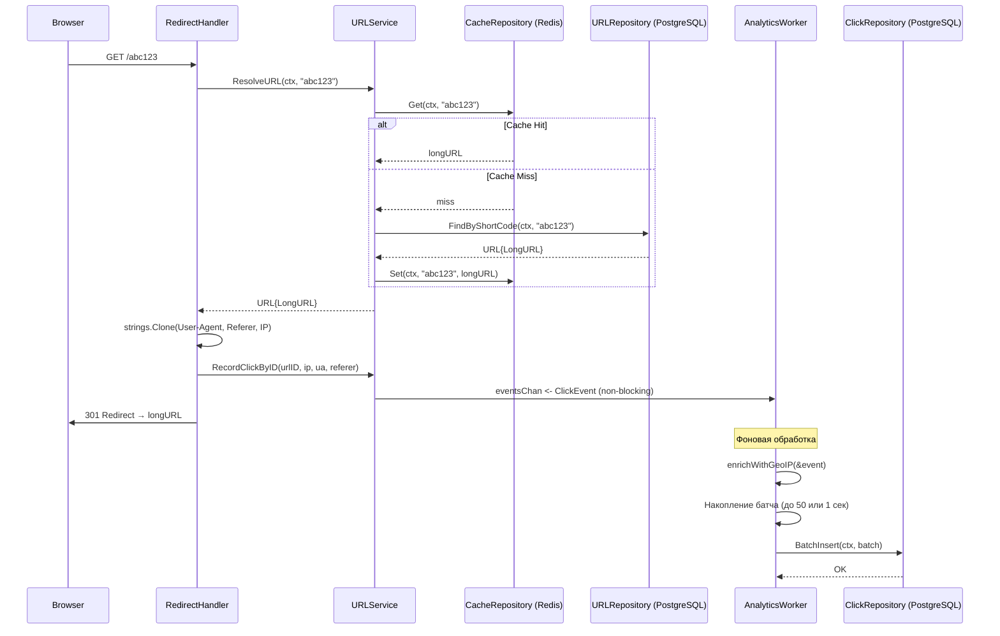
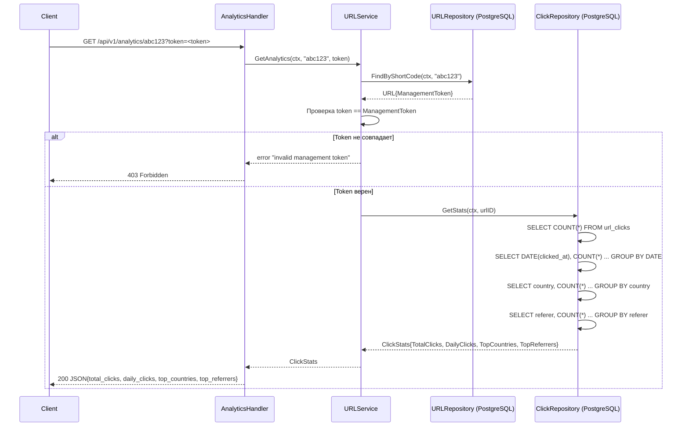

# 4. Реализация

В разделе 4 описана практическая реализация всех компонентов сервиса сокращения ссылок «ShortLink» с асинхронной аналитикой переходов и GeoIP-обогащением.

Модель данных представлена тремя структурами в пакете [`domain`](internal/domain): [`URL`](internal/domain/url.go) — основная сущность сокращённой ссылки, [`ClickEvent`](internal/domain/click.go) — событие перехода, и [`ClickStats`](internal/domain/click.go) — агрегированная статистика. Слой конфигурации включает класс [`Config`](internal/config/config.go), загружающий параметры из переменных окружения с разумными значениями по умолчанию, что позволяет запускать приложение без предварительной настройки.

Слой доступа к данным состоит из трёх интерфейсов в [`repository/interfaces.go`](internal/repository/interfaces.go) и их реализаций: [`URLRepository`](internal/repository/postgres/url_repo.go) и [`ClickRepository`](internal/repository/postgres/click_repo.go) на PostgreSQL с in-memory fallback для разработки, а также [`CacheRepository`](internal/repository/redis/cache_repo.go) на Redis с in-memory fallback. Сервисный слой представлен классом [`URLService`](internal/service/url_service.go), реализующим всю бизнес-логику: создание коротких ссылок через Sqids, разрешение с кэшированием, неблокирующую запись аналитики и проверку management token.

Транспортный слой построен на базе Fiber v2 и включает пять хендлеров: [`ShortenHandler`](internal/transport/handlers/shorten.go) для создания ссылок, [`RedirectHandler`](internal/transport/handlers/redirect.go) для редиректа, [`AnalyticsHandler`](internal/transport/handlers/analytics.go) для статистики, [`DashboardHandler`](internal/transport/handlers/dashboard.go) и [`IndexHandler`](internal/transport/handlers/index.go) для веб-интерфейса. Асинхронная обработка аналитики вынесена в отдельный [`AnalyticsWorker`](internal/worker/analytics_worker.go), который читает события из буферизированного канала, обогащает их географическими данными через GeoLite2 и батчами вставляет в PostgreSQL.

Точка входа [`cmd/server/main.go`](cmd/server/main.go) реализует инициализацию всех компонентов с внедрением зависимостей, graceful shutdown по сигналам SIGINT/SIGTERM и fallback-стратегию для PostgreSQL и Redis.

## 4.1 Структура проекта

Исходный код организован по принципу «чистой архитектуры» (Clean Architecture) с разделением на домен, инфраструктуру, сервисы и транспорт. Такой подход обеспечивает слабую связанность компонентов и возможность тестирования каждого слоя изолированно.

```
url-shortener/
├── cmd/                                # Точки входа
│   └── server/
│       └── main.go                     # Запуск сервера, DI, graceful shutdown
├── internal/                           # Внутренняя логика приложения
│   ├── config/
│   │   └── config.go                   # Загрузка конфигурации из env
│   ├── domain/                         # Модели данных (сущности)
│   │   ├── url.go                      # URL-сущность
│   │   └── click.go                    # ClickEvent, ClickStats, агрегаты
│   ├── repository/                     # Интерфейсы доступа к данным
│   │   ├── interfaces.go               # URLRepository, ClickRepository, CacheRepository
│   │   ├── postgres/                   # Реализации на PostgreSQL + in-memory
│   │   │   ├── url_repo.go             # URLRepository (pgx + in-memory)
│   │   │   ├── click_repo.go           # ClickRepository (pgx.Batch)
│   │   │   ├── click_repo_memory_test.go
│   │   │   └── url_repo.go
│   │   └── redis/                      # Реализация кэша на Redis + in-memory
│   │       └── cache_repo.go           # CacheRepository (Redis + map fallback)
│   ├── service/
│   │   ├── url_service.go              # Бизнес-логика: создание, редирект, аналитика
│   │   └── url_service_test.go         # Модульные тесты сервиса
│   ├── transport/                      # HTTP-слой (Fiber v2)
│   │   ├── router.go                   # Настройка маршрутов и middleware
│   │   ├── clientip/                   # Утилита извлечения IP клиента
│   │   │   ├── clientip.go
│   │   │   └── clientip_test.go
│   │   ├── handlers/                   # HTTP-хендлеры
│   │   │   ├── shorten.go              # POST /api/v1/shorten
│   │   │   ├── redirect.go             # GET /:code
│   │   │   ├── analytics.go            # GET /api/v1/analytics/:code
│   │   │   ├── dashboard.go            # GET /dashboard
│   │   │   ├── index.go                # GET /
│   │   │   └── templates/              # HTML-шаблоны (embedded)
│   │   │       ├── dashboard.html
│   │   │       └── index.html
│   │   └── middleware/
│   │       └── middleware.go           # Логирование запросов
│   ├── worker/                         # Фоновые обработчики
│   │   ├── analytics_worker.go         # Батчевая запись кликов + GeoIP
│   │   ├── analytics_worker_test.go
│   │   ├── geoip_countries_test.go
│   │   └── geoip_testhelper_test.go
│   ├── migrator/
│   │   └── migrator.go                 # Запуск SQL-миграций
│   └── test_e2e/                       # Интеграционные/E2E-тесты
│       ├── e2e_test.go                 # Основной E2E-тест
│       └── geoip_e2e_test.go           # E2E-тест GeoIP
├── migrations/                         # SQL-миграции
│   ├── 000001_create_urls_table.up.sql
│   ├── 000001_create_urls_table.down.sql
│   ├── 000002_create_url_clicks_table.up.sql
│   ├── 000002_create_url_clicks_table.down.sql
│   ├── 000003_expand_country_column.up.sql
│   └── 000003_expand_country_column.down.sql
├── geoip/                              # GeoLite2 база (скачивается отдельно)
│   └── README.md
├── api/
│   └── openapi.yaml                    # OpenAPI-спецификация
├── templates/                          # Дубликаты шаблонов (для тестов)
│   └── dashboard.html
├── plans/                              # Документация планирования
│   └── architecture-plan.md
├── docs/                               # Техническая документация
│   ├── introduction.md
│   ├── architecture.md
│   ├── realization.md
│   ├── deployment.md
│   ├── tech.md
│   ├── part_testing.md
│   ├── analitics.md
│   ├── project.md
│   ├── references.md
│   └── API.md
├── .env.example                        # Пример переменных окружения
├── .golangci.yml                       # Конфигурация линтера
├── docker-compose.yml                  # Docker Compose (PostgreSQL + Redis + app)
├── Dockerfile                          # Многостадийная сборка
├── go.mod / go.sum                     # Модульные зависимости
├── Makefile                            # Автоматизация сборки и тестов
└── README.md
```

Ключевое архитектурное решение — все зависимости проходят через интерфейсы, определённые в [`internal/repository/interfaces.go`](internal/repository/interfaces.go). Это позволяет подменять реализации PostgreSQL на in-memory при недоступности базы данных, а Redis — на map-кэш. Такая стратегия особенно полезна при локальной разработке и в CI-среде, где внешние сервисы могут быть недоступны.

## 4.2 Модели данных

Центральными моделями данных являются три структуры в пакете [`internal/domain`](internal/domain). В отличие от классического подхода с ORM или тяжеловесными фреймворками, здесь используются простые Go-структуры без методов — только поля с JSON-тегами для сериализации. Такой выбор обусловлен несколькими причинами: во-первых, Go не требует ORM для работы с PostgreSQL благодаря библиотеке [`pgx`](https://github.com/jackc/pgx), которая умеет сканировать строки напрямую в структуры; во-вторых, отсутствие методов на моделях упрощает их тестирование и исключает соблазн смешивать бизнес-логику с данными.

### 4.2.1 Сущность URL

Структура [`URL`](internal/domain/url.go) представляет сокращённую ссылку и содержит шесть полей:

```go
type URL struct {
    ID              int64     `json:"id"`
    LongURL         string    `json:"long_url"`
    ShortCode       *string   `json:"short_code"`
    ManagementToken string    `json:"management_token"`
    CreatedAt       time.Time `json:"created_at"`
    UpdatedAt       time.Time `json:"updated_at"`
}
```

Поле `ID` — первичный ключ, генерируемый последовательностью PostgreSQL. Именно числовой ID кодируется в короткий код через библиотеку Sqids, что гарантирует уникальность коротких ссылок без необходимости проверять коллизии. Поле `LongURL` хранит исходный длинный URL, который пользователь хочет сократить. Поле `ShortCode` — указатель на строку (`*string`), а не просто `string`, поскольку при создании записи короткий код ещё не сгенерирован: сначала выполняется INSERT, возвращается ID, и только затем ID кодируется в Sqids и обновляется в записи. Использование указателя позволяет явно различать состояние «код ещё не назначен» (NULL в БД) и «код пуст». Поле `ManagementToken` — уникальный токен для управления ссылкой (просмотр аналитики). Он генерируется на стороне PostgreSQL через `gen_random_uuid()` при вставке и возвращается пользователю один раз — при создании ссылки. Поля `CreatedAt` и `UpdatedAt` — временные метки создания и последнего обновления записи.

### 4.2.2 Событие перехода

Структура [`ClickEvent`](internal/domain/click.go) представляет единичный переход по короткой ссылке:

```go
type ClickEvent struct {
    URLID     int64     `json:"url_id"`
    IPAddress string    `json:"ip_address"`
    UserAgent string    `json:"user_agent"`
    Referer   string    `json:"referer"`
    Country   string    `json:"country"`
    City      string    `json:"city"`
    ClickedAt time.Time `json:"clicked_at"`
}
```

Поле `URLID` ссылается на ID записи в таблице `urls`. Поля `IPAddress`, `UserAgent` и `Referer` собираются из HTTP-запроса при редиректе. Поля `Country` и `City` заполняются асинхронно в [`AnalyticsWorker`](internal/worker/analytics_worker.go) через GeoIP- lookup по IP-адресу. Поле `ClickedAt` фиксирует момент перехода. Важно отметить, что `ClickEvent` — это не запись в БД, а событие, передаваемое через канал. Структура таблицы `url_clicks` идентична, но Country и City могут остаться пустыми, если GeoIP-база недоступна или IP-адрес приватный.

### 4.2.3 Агрегированная статистика

Структура [`ClickStats`](internal/domain/click.go) и вспомогательные типы служат для передачи агрегированных данных из репозитория в хендлер аналитики:

```go
type ClickStats struct {
    TotalClicks  int64             `json:"total_clicks"`
    DailyClicks  []DailyClickCount `json:"daily_clicks"`
    TopCountries []CountryCount    `json:"top_countries"`
    TopReferrers []ReferrerCount   `json:"top_referrers"`
}

type DailyClickCount struct {
    Date  string `json:"date"`
    Count int64  `json:"count"`
}

type CountryCount struct {
    Country string `json:"country"`
    Count   int64  `json:"count"`
}

type ReferrerCount struct {
    Referrer string `json:"referrer"`
    Count    int64  `json:"count"`
}
```

`TotalClicks` — общее количество переходов по ссылке. `DailyClicks` — массив с количеством переходов по дням за последние 30 дней, что позволяет построить график динамики популярности ссылки. `TopCountries` — топ-10 стран по количеству переходов (пустые значения нормализуются в "Unknown"). `TopReferrers` — топ-10 источников переходов (пустые рефереры нормализуются в "Direct"). Все три агрегации выполняются одним SQL-запросом в [`ClickRepository.GetStats()`](internal/repository/postgres/click_repo.go).

## 4.3 Слой конфигурации

Конфигурация приложения реализована в пакете [`internal/config`](internal/config/config.go) и следует принципу «12-факторного приложения»: все настройки передаются через переменные окружения. Структура [`Config`](internal/config/config.go) содержит поля для настройки HTTP-сервера, подключения к PostgreSQL, Redis и пути к GeoIP-базе.

```go
type Config struct {
    AppPort int
    AppEnv  string
    BaseURL string

    PostgresHost     string
    PostgresPort     int
    PostgresUser     string
    PostgresPassword string
    PostgresDB       string
    PostgresSSLMode  string

    RedisHost     string
    RedisPort     int
    RedisPassword string

    GeoIPDBPath string
}
```

Функция [`Load()`](internal/config/config.go:56) читает переменные окружения и возвращает заполненную структуру. Для каждого параметра предусмотрено значение по умолчанию, что позволяет запустить приложение без создания `.env`-файла:

| Переменная | Значение по умолчанию | Назначение |
|---|---|---|
| `APP_PORT` | `8080` | Порт HTTP-сервера |
| `APP_ENV` | `development` | Окружение (development/production) |
| `BASE_URL` | `http://localhost:8080` | Базовый URL для формирования коротких ссылок |
| `POSTGRES_HOST` | `localhost` | Хост PostgreSQL |
| `POSTGRES_PORT` | `5432` | Порт PostgreSQL |
| `POSTGRES_USER` | `urlshortener` | Пользователь PostgreSQL |
| `POSTGRES_PASSWORD` | `urlshortener` | Пароль PostgreSQL |
| `POSTGRES_DB` | `urlshortener` | Имя БД PostgreSQL |
| `POSTGRES_SSLMODE` | `disable` | Режим SSL для PostgreSQL |
| `REDIS_HOST` | `localhost` | Хост Redis |
| `REDIS_PORT` | `6379` | Порт Redis |
| `REDIS_PASSWORD` | `` | Пароль Redis |
| `GEOIP_DB_PATH` | `./geoip/GeoLite2-City.mmdb` | Путь к GeoIP базе |

Для удобства в структуру добавлены методы-хелперы: [`PostgresDSN()`](internal/config/config.go:31) возвращает URI-строку подключения, [`PostgresConnString()`](internal/config/config.go:41) — строку для pgx, [`RedisAddr()`](internal/config/config.go:51) — адрес Redis в формате `host:port`, а [`AppAddr()`](internal/config/config.go:78) — адрес для прослушивания в формате `:port`. Также определены методы [`ReadTimeout()`](internal/config/config.go:83), [`WriteTimeout()`](internal/config/config.go:88) и [`IdleTimeout()`](internal/config/config.go:93), возвращающие таймауты для HTTP-сервера.

Функции [`getEnv()`](internal/config/config.go:97) и [`getEnvInt()`](internal/config/config.go:104) — внутренние утилиты, читающие переменные окружения с возвратом значения по умолчанию, если переменная не установлена или не может быть преобразована в целое число.

## 4.4 Слой доступа к данным

Слой доступа к данным спроектирован вокруг трёх интерфейсов в [`internal/repository/interfaces.go`](internal/repository/interfaces.go): [`URLRepository`](internal/repository/interfaces.go:10), [`ClickRepository`](internal/repository/interfaces.go:25) и [`CacheRepository`](internal/repository/interfaces.go:34). Каждый интерфейс определяет контракт для работы с соответствующим хранилищем, а реализации могут быть подменены без изменения вызывающего кода. Это ключевой элемент архитектуры, обеспечивающий тестируемость и устойчивость к отказам внешних сервисов.

### 4.4.1 URLRepository — PostgreSQL и in-memory

Интерфейс [`URLRepository`](internal/repository/interfaces.go:10) определяет четыре метода:

- [`Insert(ctx, longURL)`](internal/repository/postgres/url_repo.go) — создаёт новую запись и возвращает её с заполненными ID, ManagementToken и временными метками.
- [`FindByShortCode(ctx, shortCode)`](internal/repository/postgres/url_repo.go) — ищет запись по короткому коду.
- [`UpdateShortCode(ctx, id, shortCode)`](internal/repository/postgres/url_repo.go) — обновляет короткий код после его генерации.
- [`FindByManagementToken(ctx, token)`](internal/repository/postgres/url_repo.go) — ищет запись по management token (зарезервировано для будущего использования).

Реализация на PostgreSQL использует пул соединений [`pgxpool`](https://github.com/jackc/pgx) и параметризованные запросы, что полностью исключает SQL-инъекции. Метод `Insert` использует конструкцию `INSERT ... RETURNING`, которая возвращает все поля созданной записи одним запросом — это эффективнее, чем отдельный SELECT после INSERT:

```go
func (r *URLRepository) Insert(ctx context.Context, longURL string) (*domain.URL, error) {
    url := &domain.URL{}
    err := r.pool.QueryRow(ctx,
        `INSERT INTO urls (long_url) VALUES ($1)
         RETURNING id, long_url, short_code, management_token::text, created_at, updated_at`,
        longURL,
    ).Scan(&url.ID, &url.LongURL, &url.ShortCode, &url.ManagementToken, &url.CreatedAt, &url.UpdatedAt)
    return url, err
}
```

Обратите внимание на приведение `management_token::text` — в PostgreSQL токен хранится как `uuid`, а pgx возвращает его как `[16]byte`. Явное приведение к `text` позволяет сканировать значение напрямую в строку Go.

In-memory реализация [`URLRepository`](internal/repository/postgres/url_repo.go) использует `sync.RWMutex` и две map: одну для поиска по ID, другую — по short code. Это обеспечивает потокобезопасность и консистентность данных при параллельных запросах. In-memory версия включается автоматически, если PostgreSQL недоступен при запуске.

### 4.4.2 ClickRepository — батчевая вставка и агрегация

Интерфейс [`ClickRepository`](internal/repository/interfaces.go:25) определяет два метода:

- [`BatchInsert(ctx, events)`](internal/repository/postgres/click_repo.go) — вставляет несколько событий перехода одной транзакцией.
- [`GetStats(ctx, urlID)`](internal/repository/postgres/click_repo.go) — возвращает агрегированную статистику.

Реализация `BatchInsert` использует [`pgx.Batch`](https://pkg.go.dev/github.com/jackc/pgx/v5#Batch), который отправляет все INSERT-запросы одним сетевым вызовом и выполняет их в одной транзакции. Это на порядки эффективнее, чем вставлять события по одному:

```go
func (r *ClickRepository) BatchInsert(ctx context.Context, events []domain.ClickEvent) error {
    batch := &pgx.Batch{}
    for _, event := range events {
        batch.Queue(`INSERT INTO url_clicks
            (url_id, ip_address, user_agent, referer, country, city, clicked_at)
            VALUES ($1, $2, $3, $4, $5, $6, $7)`,
            event.URLID, event.IPAddress, event.UserAgent,
            event.Referer, event.Country, event.City, event.ClickedAt)
    }
    br := r.pool.SendBatch(ctx, batch)
    defer br.Close()
    for range events {
        if _, err := br.Exec(); err != nil {
            return err
        }
    }
    return nil
}
```

Реализация `GetStats` выполняет четыре SQL-запроса в рамках одного метода: подсчёт общего числа переходов, ежедневная статистика за 30 дней, топ-10 стран и топ-10 рефереров. Пустые значения стран нормализуются в "Unknown", пустые рефереры — в "Direct" через `COALESCE(NULLIF(TRIM(country), ''), 'Unknown')`.

### 4.4.3 CacheRepository — Redis и in-memory fallback

Интерфейс [`CacheRepository`](internal/repository/interfaces.go:34) определяет три метода:

- [`Get(ctx, shortCode)`](internal/repository/redis/cache_repo.go) — получает длинный URL по короткому коду.
- [`Set(ctx, shortCode, longURL)`](internal/repository/redis/cache_repo.go) — сохраняет пару «короткий код → длинный URL» с TTL.
- [`Delete(ctx, shortCode)`](internal/repository/redis/cache_repo.go) — удаляет запись из кэша.

Реализация на Redis использует клиент [`go-redis/redis`](https://github.com/redis/go-redis) и команду `SET` с экспирацией. TTL задаётся при создании репозитория через параметр `expiration` (по умолчанию 0 — без экспирации). In-memory fallback реализован через `sync.Map` с TTL-таймерами, что обеспечивает корректное истечение срока действия записей даже при отсутствии Redis.

Кэш играет критическую роль в производительности редиректов: при кэш-хите сервис возвращает URL без обращения к PostgreSQL, что снижает задержку с ~5-10 мс (запрос к БД) до ~0.5-1 мс (чтение из Redis или in-memory map). Учитывая, что редирект — самый частый сценарий использования, это даёт существенный выигрыш в пропускной способности.

## 4.5 Сервисный слой

Сервисный слой представлен единственным классом [`URLService`](internal/service/url_service.go), который реализует всю бизнес-логику приложения. В отличие от многослойных сервисных архитектур, здесь используется один сервис, поскольку функциональность приложения сфокусирована на одной предметной области — сокращении ссылок и сборе аналитики. Разделение на несколько сервисов было бы преждевременной декомпозицией.

Конструктор [`NewURLService()`](internal/service/url_service.go:30) принимает пять зависимостей через внедрение зависимостей (Dependency Injection):

```go
func NewURLService(
    urlRepo repository.URLRepository,
    clickRepo repository.ClickRepository,
    cacheRepo repository.CacheRepository,
    eventsChan chan<- domain.ClickEvent,
    baseURL string,
) (*URLService, error) {
    s, err := sqids.New(sqids.Options{MinLength: 6})
    if err != nil {
        return nil, fmt.Errorf("failed to initialize sqids: %w", err)
    }
    return &URLService{
        urlRepo: urlRepo, clickRepo: clickRepo,
        cacheRepo: cacheRepo, eventsChan: eventsChan,
        sqids: s, baseURL: baseURL,
    }, nil
}
```

В конструкторе инициализируется библиотека [`Sqids`](https://github.com/sqids/sqids-go) (ранее Hashids) с минимальной длиной кода 6 символов. Sqids преобразует числовой ID записи в короткую строку, используя алфавит без нецензурных слов и омонимов. Параметр `MinLength: 6` гарантирует, что даже для ID = 1 короткий код будет иметь длину не менее 6 символов (например, `"gX7f1A"`), что затрудняет подбор существующих ссылок.

### 4.5.1 Создание короткой ссылки

Метод [`CreateShortURL()`](internal/service/url_service.go:56) реализует четырёхшаговый пайплайн создания короткой ссылки:

1. **INSERT в PostgreSQL** — вызов `urlRepo.Insert()` создаёт запись с длинным URL и возвращает структуру с заполненными ID, ManagementToken и временными метками. ManagementToken генерируется на стороне БД через `gen_random_uuid()`.
2. **Кодирование ID в Sqids** — числовой ID преобразуется в короткую строку. Поскольку ID уникален (serial), короткий код гарантированно уникален без дополнительных проверок.
3. **UPDATE short_code** — сгенерированный код сохраняется в записи через `urlRepo.UpdateShortCode()`.
4. **Кэширование** — пара «короткий код → длинный URL» сохраняется в Redis (или in-memory fallback). Ошибка кэширования не фатальна — при кэш-миссе сервис обратится к PostgreSQL.

После выполнения всех шагов пользователю возвращается структура `domain.URL` с заполненным `ShortCode`. Хендлер формирует из неё JSON-ответ с полями `short_url`, `short_code` и `management_token`.

### 4.5.2 Разрешение короткой ссылки (редирект)

Метод [`ResolveURL()`](internal/service/url_service.go:86) реализует стратегию «cache-first, database-second»:

```go
func (s *URLService) ResolveURL(ctx context.Context, shortCode string) (*domain.URL, error) {
    // 1. Try cache first
    longURL, err := s.cacheRepo.Get(ctx, shortCode)
    if err == nil && longURL != "" {
        return &domain.URL{ShortCode: &shortCode, LongURL: longURL}, nil
    }
    // 2. Cache miss — query database
    url, err := s.urlRepo.FindByShortCode(ctx, shortCode)
    if err != nil {
        return nil, fmt.Errorf("URL not found: %w", err)
    }
    // 3. Populate cache asynchronously (best-effort)
    _ = s.cacheRepo.Set(ctx, shortCode, url.LongURL)
    return url, nil
}
```

Сначала проверяется кэш. Если запись найдена, возвращается минимальный объект `URL` с заполненными `ShortCode` и `LongURL` — остальные поля не нужны для редиректа. Если кэш-мисс, выполняется запрос к PostgreSQL, и результат асинхронно помещается в кэш для ускорения последующих запросов. Ошибка кэширования игнорируется — это best-effort операция.

### 4.5.3 Запись аналитики

Метод [`RecordClickByID()`](internal/service/url_service.go:124) реализует неблокирующую отправку события перехода в канал `AnalyticsWorker`:

```go
func (s *URLService) RecordClickByID(ctx context.Context, urlID int64, ip, userAgent, referer string) {
    event := domain.ClickEvent{
        URLID: urlID, IPAddress: ip,
        UserAgent: userAgent, Referer: referer,
        ClickedAt: time.Now(),
    }
    select {
    case s.eventsChan <- event:
        // Event sent successfully
    default:
        // Channel full, drop event to avoid blocking the redirect
    }
}
```

Конструкция `select` с `default` гарантирует, что отправка никогда не заблокирует хендлер редиректа. Если канал переполнен (буфер 1000 событий), событие дропается. Это осознанный компромисс: потеря нескольких событий аналитики при пиковой нагрузке допустима, но задержка редиректа — нет.

Метод [`RecordClick()`](internal/service/url_service.go:114) — более старая версия, которая сначала ищет URL по short code в БД, а затем вызывает `RecordClickByID()`. Он сохранён для обратной совместимости, но в текущей реализации хендлер редиректа использует `RecordClickByID()` напрямую, избегая лишнего запроса к БД.

### 4.5.4 Получение аналитики

Метод [`GetAnalytics()`](internal/service/url_service.go:144) реализует проверку прав доступа и получение статистики:

```go
func (s *URLService) GetAnalytics(ctx context.Context, shortCode, token string) (*domain.ClickStats, error) {
    url, err := s.urlRepo.FindByShortCode(ctx, shortCode)
    if err != nil {
        return nil, fmt.Errorf("URL not found: %w", err)
    }
    if url.ManagementToken != token {
        return nil, fmt.Errorf("invalid management token")
    }
    stats, err := s.clickRepo.GetStats(ctx, url.ID)
    if err != nil {
        return nil, fmt.Errorf("failed to get analytics: %w", err)
    }
    return stats, nil
}
```

Сначала находится запись URL по короткому коду. Затем сравнивается management token из запроса с сохранённым в БД. Если токен не совпадает, возвращается ошибка `"invalid management token"` с HTTP-статусом 403 Forbidden. Если токен верен, вызывается `ClickRepository.GetStats()`, который выполняет агрегирующие SQL-запросы и возвращает структуру `ClickStats`.

## 4.6 Транспортный слой

Транспортный слой построен на базе веб-фреймворка [Fiber v2](https://github.com/gofiber/fiber) и включает пять HTTP-хендлеров, конфигурацию маршрутов и middleware. Fiber выбран по нескольким причинам: он построен на FastHTTP, что обеспечивает высокую производительность; его API вдохновлён Express.js, что делает код лаконичным и читаемым; он поддерживает middleware-цепочки, встроенный recovery и CORS.

### 4.6.1 Конфигурация маршрутов

Функция [`SetupRoutes()`](internal/transport/router.go:62) собирает все маршруты приложения:

```go
func SetupRoutes(
    shortenHandler *handlers.ShortenHandler,
    redirectHandler *handlers.RedirectHandler,
    analyticsHandler *handlers.AnalyticsHandler,
    dashboardHandler *handlers.DashboardHandler,
    indexHandler *handlers.IndexHandler,
) *fiber.App {
    app := fiber.New(productionFiberConfig())
    mountRoutes(app, shortenHandler, redirectHandler, analyticsHandler, dashboardHandler, indexHandler)
    return app
}
```

Маршруты делятся на три группы:

- **Публичные страницы**: `GET /` — лендинг, `GET /dashboard` — дашборд аналитики.
- **API v1**: `POST /api/v1/shorten` — создание ссылки, `GET /api/v1/analytics/:code` — получение аналитики.
- **Редирект**: `GET /:code` — переход по короткой ссылке (должен быть последним, чтобы не перекрывать другие маршруты).

Конфигурация Fiber включает поддержку доверенных прокси (`ProxyHeader: X-Forwarded-For`), что необходимо для корректного определения IP клиента за Docker bridge или reverse proxy. В тестовой конфигурации проверка прокси отключается, поскольку `httptest` не использует reverse proxy.

Глобальные middleware подключаются в порядке выполнения:

1. [`Logger()`](internal/transport/middleware/middleware.go:11) — логирует каждый запрос в формате `[METHOD] /path client_ip - status_code (duration)`.
2. [`recover.New()`](https://docs.gofiber.io/api/middleware/recover) — встроенный recovery, перехватывающий паники и возвращающий 500.
3. [`cors.New()`](https://docs.gofiber.io/api/middleware/cors) — CORS с разрешением всех origins для удобства разработки.

### 4.6.2 Хендлер сокращения ссылок

[`ShortenHandler`](internal/transport/handlers/shorten.go) обрабатывает `POST /api/v1/shorten`. Он принимает JSON-тело с полем `url`, валидирует его (проверяет, что URL не пуст и имеет схему http/https), вызывает `URLService.CreateShortURL()` и возвращает JSON с короткой ссылкой, кодом и management token. При невалидном URL возвращается 400 Bad Request, при ошибке сервиса — 500 Internal Server Error.

### 4.6.3 Хендлер редиректа

[`RedirectHandler`](internal/transport/handlers/redirect.go) обрабатывает `GET /:code` — самый критичный по производительности маршрут. Последовательность действий:

1. Извлечение short code из параметра пути.
2. Вызов `URLService.ResolveURL()` для получения длинного URL.
3. Клонирование строк User-Agent, Referer и IP-адреса через `strings.Clone()`.
4. Асинхронная отправка события клика через `URLService.RecordClick()`.
5. Редирект 301 Moved Permanently на длинный URL.

Клонирование строк — критическая деталь, связанная с архитектурой FastHTTP. Fiber использует zero-copy string interning: строки из HTTP-заголовков указывают на внутренний буфер запроса, который переиспользуется при обработке следующего запроса. Если передать эти строки в канал без клонирования, к моменту обработки события воркером данные могут быть повреждены. `strings.Clone()` создаёт новую аллокацию в куче, что гарантирует целостность данных.

### 4.6.4 Хендлер аналитики

[`AnalyticsHandler`](internal/transport/handlers/analytics.go) обрабатывает `GET /api/v1/analytics/:code`. Он извлекает short code из пути и management token из query-параметра `token`. Если токен отсутствует — 401 Unauthorized. Если токен неверен или ссылка не найдена — 403 Forbidden. При успехе возвращает JSON со структурой `ClickStats`.

### 4.6.5 Хендлеры веб-страниц

[`DashboardHandler`](internal/transport/handlers/dashboard.go) и [`IndexHandler`](internal/transport/handlers/index.go) используют директиву `//go:embed` для встраивания HTML-шаблонов в бинарник. Это позволяет разворачивать сервис как единый исполняемый файл без внешних статических ресурсов — достаточно скопировать бинарник на сервер и запустить.

Шаблоны парсятся при инициализации хендлера через `template.ParseFS()`. Если парсинг не удался, приложение завершается с `log.Fatalf()` — это гарантирует, что сервер не запустится с повреждёнными шаблонами.

Дашборд аналитики представляет собой одностраничное приложение на чистом JavaScript, которое через Fetch API обращается к эндпоинту `/api/v1/analytics/:code?token=...` и отображает данные в таблицах: общее количество переходов, ежедневная статистика, топ стран и топ рефереров.

## 4.7 Асинхронная обработка аналитики

Аналитика переходов — вторая по важности функция после редиректа. Поскольку запись в БД на каждый клик создавала бы неприемлемую задержку, обработка вынесена в фоновый [`AnalyticsWorker`](internal/worker/analytics_worker.go), работающий в отдельной горутине.

### 4.7.1 Архитектура worker'а

`AnalyticsWorker` реализует паттерн «производитель-потребитель» (Producer-Consumer):

- **Производитель** — хендлер редиректа, который отправляет события в буферизированный канал `chan domain.ClickEvent` ёмкостью 1000 событий.
- **Потребитель** — `AnalyticsWorker`, который читает события из канала, обогащает их географическими данными и батчами вставляет в PostgreSQL.

Конструктор [`NewAnalyticsWorker()`](internal/worker/analytics_worker.go:36) принимает `ClickRepository` и путь к GeoIP-базе. Если путь пуст или база не найдена, GeoIP-обогащение отключается — worker продолжает работать, но поля Country и City остаются пустыми.

### 4.7.2 Батчевая обработка

Метод [`Start()`](internal/worker/analytics_worker.go:67) запускает основной цикл worker'а:

```go
func (w *AnalyticsWorker) Start(ctx context.Context) {
    batch := make([]domain.ClickEvent, 0, BatchSize)  // BatchSize = 50
    ticker := time.NewTicker(FlushInterval)             // FlushInterval = 1 сек
    defer ticker.Stop()
    for {
        select {
        case <-ctx.Done():
            if len(batch) > 0 { w.flush(batch) }       // сброс при graceful shutdown
            return
        case event := <-w.events:
            if w.geoIP != nil { w.enrichWithGeoIP(&event) }
            batch = append(batch, event)
            if len(batch) >= BatchSize { w.flush(batch); batch = make(...) }
        case <-ticker.C:
            if len(batch) > 0 { w.flush(batch); batch = make(...) }
        }
    }
}
```

Батч накапливается до 50 событий или до истечения 1 секунды — в зависимости от того, что наступит раньше. Такой подход обеспечивает два важных свойства:

1. **Амортизация накладных расходов** — вставка 50 записей одной транзакцией через `pgx.Batch` примерно в 10-20 раз быстрее, чем 50 отдельных INSERT.
2. **Гарантия доставки** — даже при низкой нагрузке события не задерживаются в канале дольше 1 секунды.

При получении сигнала завершения (`ctx.Done()`) worker сбрасывает оставшиеся события перед остановкой — это гарантирует, что ни одно событие не будет потеряно при graceful shutdown.

### 4.7.3 GeoIP-обогащение

Метод [`enrichWithGeoIP()`](internal/worker/analytics_worker.go:107) определяет страну и город по IP-адресу, используя базу [GeoLite2-City](https://dev.maxmind.com/geoip/geolite2-free-geolocation-data) от MaxMind:

```go
func (w *AnalyticsWorker) enrichWithGeoIP(event *domain.ClickEvent) {
    ip := net.ParseIP(event.IPAddress)
    if isPrivateIP(ip) { event.Country = "LOCAL"; return }
    record, err := w.geoIP.City(ip)
    if record.Country.IsoCode != "" { event.Country = record.Country.IsoCode }
    if name, ok := record.City.Names["en"]; ok { event.City = name }
}
```

Логика обработки:

- Если IP-адрес пустой — страна устанавливается в `"LOCAL"`.
- Если IP приватный (RFC 1918, loopback, link-local) — страна устанавливается в `"LOCAL"`. Это важно, поскольку MaxMind не содержит данных для приватных диапазонов, и без этой проверки lookup вернул бы ошибку.
- Если GeoIP-ридер недоступен — обогащение пропускается, поля остаются пустыми.
- В остальных случаях выполняется lookup: страна извлекается из двухбуквенного кода ISO, город — из англоязычного названия.

Функция [`isPrivateIP()`](internal/worker/analytics_worker.go:156) проверяет, относится ли IP к приватным диапазонам, используя стандартные методы `net.IP.IsLoopback()`, `IsLinkLocalUnicast()` и `IsPrivate()`.

### 4.7.4 Сброс батча в БД

Метод [`flush()`](internal/worker/analytics_worker.go:144) записывает батч событий в PostgreSQL:

```go
func (w *AnalyticsWorker) flush(batch []domain.ClickEvent) {
    ctx, cancel := context.WithTimeout(context.Background(), 10*time.Second)
    defer cancel()
    if err := w.clickRepo.BatchInsert(ctx, batch); err != nil {
        log.Printf("ERROR: Failed to batch insert %d click events: %v", len(batch), err)
        return
    }
    log.Printf("Flushed %d click events to database", len(batch))
}
```

Таймаут 10 секунд предотвращает зависание worker'а при недоступности БД. В случае ошибки события теряются — это осознанный компромисс, так как повторная обработка потребовала бы очереди с подтверждением (как в Kafka или RabbitMQ), что избыточно для данного приложения.

## 4.8 Точка входа и Graceful Shutdown

Файл [`cmd/server/main.go`](cmd/server/main.go) является точкой входа в приложение. Функция `main()` выполняет инициализацию всех компонентов в строгой последовательности и реализует graceful shutdown для корректного завершения работы.

### 4.8.1 Инициализация компонентов

Последовательность инициализации:

1. **Загрузка конфигурации** — `config.Load()` читает переменные окружения.
2. **Инициализация репозиториев** — сначала PostgreSQL, с fallback на in-memory при недоступности. Если PostgreSQL доступен, запускаются миграции.
3. **Инициализация кэша** — Redis с fallback на in-memory map.
4. **Создание AnalyticsWorker** — передаётся clickRepo и путь к GeoIP-базе.
5. **Создание URLService** — внедряются все зависимости (репозитории, канал событий, baseURL).
6. **Создание хендлеров** — каждый хендлер получает URLService.
7. **Настройка маршрутов** — `transport.SetupRoutes()` собирает Fiber-приложение.

### 4.8.2 Fallback-стратегия

Ключевая особенность инициализации — стратегия fallback для внешних сервисов:

```go
// PostgreSQL fallback
pgRepo, err := postgres.NewURLRepository(cfg.PostgresConnString())
if err != nil {
    log.Printf("WARNING: PostgreSQL not available, using in-memory fallback: %v", err)
    urlRepo = postgres.NewInMemoryURLRepository()
    clickRepo = postgres.NewInMemoryClickRepository()
} else {
    urlRepo = pgRepo
    clickRepo = postgres.NewClickRepositoryFromPool(pgRepo.Pool())
    migrator.RunUp(context.Background(), pgRepo.Pool(), "migrations")
}

// Redis fallback
redisCache, err := redis.NewCacheRepository(cfg.RedisAddr(), cfg.RedisPassword, 0)
if err != nil {
    log.Printf("WARNING: Redis not available, using in-memory cache fallback: %v", err)
    cacheRepo = redis.NewInMemoryCacheRepository()
} else {
    cacheRepo = redisCache
}
```

Если PostgreSQL недоступен, используются in-memory реализации `URLRepository` и `ClickRepository`. Если Redis недоступен — in-memory `CacheRepository`. Это позволяет запускать приложение в средах без внешних зависимостей (локальная разработка, CI) и гарантирует, что сервис не упадёт при временной недоступности инфраструктуры.

### 4.8.3 Graceful Shutdown

Завершение работы реализовано через контекст с сигналами:

```go
ctx, stop := signal.NotifyContext(context.Background(), syscall.SIGINT, syscall.SIGTERM)
defer stop()

go analyticsWorker.Start(ctx)   // фоновая обработка аналитики
go app.Listen(cfg.AppAddr())    // HTTP-сервер

<-ctx.Done()                    // ожидание Ctrl+C или SIGTERM
app.Shutdown()                  // остановка сервера
analyticsWorker.Close()         // закрытие GeoIP-базы
```

Порядок завершения важен:

1. `signal.NotifyContext` создаёт контекст, который отменяется при получении SIGINT (Ctrl+C) или SIGTERM.
2. `<-ctx.Done()` блокирует main-горутину до получения сигнала.
3. При получении сигнала сначала вызывается `app.Shutdown()` — Fiber останавливает приём новых запросов и завершает обработку текущих.
4. Затем `analyticsWorker.Close()` закрывает GeoIP-ридер. К этому моменту AnalyticsWorker уже получил сигнал через `ctx.Done()` и сбросил оставшиеся события из канала в БД.

## 4.9 Миграции базы данных

Миграции реализованы в пакете [`internal/migrator`](internal/migrator/migrator.go) и представляют собой простой, но эффективный механизм управления схемой PostgreSQL без внешних зависимостей (таких как golang-migrate или goose).

### 4.9.1 Принцип работы

Мигратор читает все `.up.sql` файлы из указанной директории, сортирует их по имени и применяет те, которые ещё не были применены. Для отслеживания применённых миграций используется таблица `schema_migrations`:

```sql
CREATE TABLE IF NOT EXISTS schema_migrations (
    filename    TEXT        PRIMARY KEY,
    applied_at  TIMESTAMPTZ NOT NULL DEFAULT NOW()
);
```

Каждая миграция выполняется в отдельной транзакции: сначала применяется SQL-код миграции, затем в `schema_migrations` вставляется запись о применении. Если любой из шагов завершается ошибкой, транзакция откатывается, и миграция не считается применённой.

### 4.9.2 Список миграций

В директории [`migrations/`](migrations/) находятся три миграции:

**000001_create_urls_table** — создаёт таблицу `urls`:

```sql
CREATE TABLE IF NOT EXISTS urls (
    id              BIGSERIAL    PRIMARY KEY,
    long_url        TEXT         NOT NULL,
    short_code      TEXT         UNIQUE,
    management_token UUID        NOT NULL DEFAULT gen_random_uuid(),
    created_at      TIMESTAMPTZ  NOT NULL DEFAULT NOW(),
    updated_at      TIMESTAMPTZ  NOT NULL DEFAULT NOW()
);
```

Поле `id` — BIGSERIAL, автоматически инкрементируемый 64-битный идентификатор. Поле `short_code` имеет ограничение UNIQUE, но может быть NULL (при создании записи код ещё не сгенерирован). Поле `management_token` использует тип UUID со значением по умолчанию `gen_random_uuid()`, что гарантирует уникальность токена без дополнительных проверок.

**000002_create_url_clicks_table** — создаёт таблицу `url_clicks`:

```sql
CREATE TABLE IF NOT EXISTS url_clicks (
    id          BIGSERIAL    PRIMARY KEY,
    url_id      BIGINT       NOT NULL REFERENCES urls(id) ON DELETE CASCADE,
    ip_address  TEXT         NOT NULL DEFAULT '',
    user_agent  TEXT         NOT NULL DEFAULT '',
    referer     TEXT         NOT NULL DEFAULT '',
    country     VARCHAR(10)  NOT NULL DEFAULT '',
    city        VARCHAR(255) NOT NULL DEFAULT '',
    clicked_at  TIMESTAMPTZ  NOT NULL DEFAULT NOW()
);

CREATE INDEX idx_url_clicks_url_id ON url_clicks(url_id);
CREATE INDEX idx_url_clicks_clicked_at ON url_clicks(clicked_at);
```

Внешний ключ `url_id` ссылается на `urls(id)` с каскадным удалением — при удалении ссылки все связанные клики удаляются автоматически. Индексы по `url_id` и `clicked_at` ускоряют агрегирующие запросы в `GetStats()`.

**000003_expand_country_column** — расширяет колонку `country` для хранения полных названий стран (не только ISO-кодов):

```sql
ALTER TABLE url_clicks ALTER COLUMN country TYPE VARCHAR(100);
```

### 4.9.3 Down-миграции

Для каждой up-миграции существует соответствующий down-файл, откатывающий изменения. Down-миграции не выполняются автоматически — они предназначены для ручного применения при необходимости отката:

- `000001_create_urls_table.down.sql`: `DROP TABLE IF EXISTS urls;`
- `000002_create_url_clicks_table.down.sql`: `DROP TABLE IF EXISTS url_clicks;`
- `000003_expand_country_column.down.sql`: `ALTER TABLE url_clicks ALTER COLUMN country TYPE VARCHAR(10);`

## 4.10 Потоки данных

В данном подразделе представлены диаграммы последовательностей (sequence diagrams) в нотации Mermaid, иллюстрирующие взаимодействие компонентов при выполнении основных операций.

### 4.10.1 Создание короткой ссылки



Поток начинается с POST-запроса от клиента. Хендлер валидирует URL, затем сервис последовательно вставляет запись в БД, кодирует ID в Sqids, обновляет short_code и кэширует результат. Клиенту возвращается JSON с короткой ссылкой и management token.

### 4.10.2 Редирект и асинхронная запись аналитики



Это самый сложный поток данных. Редирект выполняется синхронно: проверка кэша, при необходимости — запрос к БД, затем редирект 301. Аналитика записывается асинхронно: событие отправляется в канал (неблокирующе), и хендлер сразу возвращает ответ. AnalyticsWorker в фоне обогащает событие GeoIP-данными, накапливает батч и вставляет в PostgreSQL.

### 4.10.3 Получение аналитики



Поток получения аналитики включает проверку management token для авторизации. Если токен верен, выполняются четыре агрегирующих SQL-запроса, результаты которых упаковываются в структуру `ClickStats` и возвращаются клиенту в формате JSON.