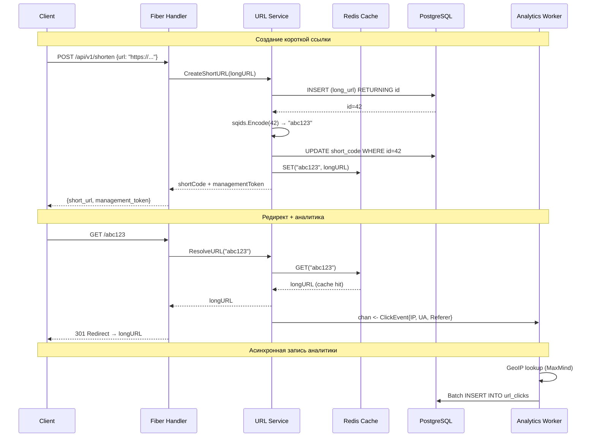
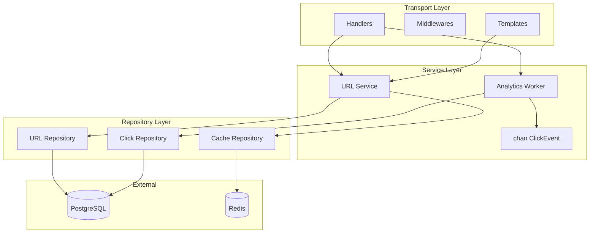

# План разработки сервиса сокращения ссылок с аналитикой (URL Shortener)

## Общая архитектура (Big Picture)

```
┌─────────────────────────────────────────────────────────────┐
│                        HTTP Client                          │
└─────────────────────┬───────────────────────────────────────┘
                      │
                      ▼
┌─────────────────────────────────────────────────────────────┐
│                   Transport Layer (Fiber)                    │
│  ┌──────────┐  ┌──────────────┐  ┌──────────────────────┐   │
│  │ Middleware│  │  Handlers    │  │  Template (HTML)     │   │
│  │(Logger,  │  │  (shorten,   │  │  Dashboard /stats    │   │
│  │ Recovery,│  │   redirect,  │  │  with Chart.js       │   │
│  │ CORS)    │  │   analytics) │  │                      │   │
│  └──────────┘  └──────┬───────┘  └──────────────────────┘   │
└────────────────────────┼────────────────────────────────────┘
                         │
                         ▼
┌─────────────────────────────────────────────────────────────┐
│                   Service Layer (Business Logic)             │
│  ┌──────────────────────────────────────────────────────┐   │
│  │  URL Service                                         │   │
│  │  • CreateShortURL(longURL) → shortCode + token       │   │
│  │  • ResolveURL(shortCode) → longURL                   │   │
│  │  • GetAnalytics(shortCode, token) → stats            │   │
│  │  • sqids.Encode(id) / sqids.Decode(code)             │   │
│  └──────────────────────┬───────────────────────────────┘   │
│                         │                                    │
│  ┌──────────────────────▼───────────────────────────────┐   │
│  │  Analytics Worker (goroutine + channel)              │   │
│  │  • читает chan ClickEvent                            │   │
│  │  • определяет GeoIP по IP (MaxMind)                  │   │
│  │  • батчевая вставка в PostgreSQL                     │   │
│  └──────────────────────────────────────────────────────┘   │
└────────────────────────┬────────────────────────────────────┘
                         │
                         ▼
┌─────────────────────────────────────────────────────────────┐
│                   Repository Layer (Data Access)             │
│  ┌────────────────────┐  ┌──────────────────────────────┐   │
│  │  URL Repository    │  │  Click Repository            │   │
│  │  (PostgreSQL/pgx)  │  │  (PostgreSQL/pgx)            │   │
│  └─────────┬──────────┘  └──────────┬───────────────────┘   │
│            │                        │                        │
│  ┌─────────▼────────────────────────▼───────────────────┐   │
│  │  Cache Repository (Redis)                            │   │
│  │  • Get(shortCode) → longURL (cache-aside)            │   │
│  │  • Set(shortCode, longURL, TTL)                      │   │
│  └──────────────────────────────────────────────────────┘   │
└────────────────────────┬────────────────────────────────────┘
                         │
              ┌──────────┴──────────┐
              ▼                     ▼
       ┌────────────┐       ┌────────────┐
       │  PostgreSQL │       │   Redis    │
       │  (primary)  │       │   (cache)  │
       └────────────┘       └────────────┘
```

## Структура проекта

```
url-shortener/
├── cmd/
│   └── server/
│       └── main.go              # Точка входа, DI-контейнер
├── internal/
│   ├── config/
│   │   └── config.go            # Чтение конфигурации из .env/переменных
│   ├── domain/
│   │   ├── url.go               # Модель URL
│   │   └── click.go             # Модель ClickEvent
│   ├── repository/
│   │   ├── interfaces.go        # Интерфейсы репозиториев
│   │   ├── postgres/
│   │   │   ├── url_repo.go      # Реализация URL Repository (pgx)
│   │   │   └── click_repo.go    # Реализация Click Repository (pgx)
│   │   └── redis/
│   │       └── cache_repo.go    # Реализация Cache Repository
│   ├── service/
│   │   ├── url_service.go       # Бизнес-логика URL
│   │   └── analytics.go         # Воркер аналитики (каналы, GeoIP)
│   ├── transport/
│   │   ├── handlers/
│   │   │   ├── shorten.go       # POST /api/v1/shorten
│   │   │   ├── redirect.go      # GET /:code
│   │   │   └── analytics.go     # GET /api/v1/analytics/:code
│   │   │   └── dashboard.go     # GET /stats/:code (HTML)
│   │   ├── middleware/
│   │   │   └── middleware.go    # Logger, Recovery, CORS
│   │   └── router.go            # Настройка маршрутов Fiber
│   └── worker/
│       └── analytics_worker.go  # Фоновая горутина для ClickEvent
├── migrations/
│   ├── 000001_create_urls_table.up.sql
│   ├── 000001_create_urls_table.down.sql
│   ├── 000002_create_url_clicks_table.up.sql
│   └── 000002_create_url_clicks_table.down.sql
├── templates/
│   └── dashboard.html           # HTML-шаблон дашборда
├── geoip/
│   └── GeoLite2-City.mmdb       # GeoIP база (gitignored, скачивается отдельно)
├── .github/
│   └── workflows/
│       └── ci.yml               # GitHub Actions: test, lint, gosec
├── docker-compose.yml           # Postgres + Redis + приложение
├── Dockerfile                   # Multi-stage build
├── .golangci.yml                # Конфигурация линтера
├── .env.example                 # Пример переменных окружения
├── go.mod
├── go.sum
└── README.md
```

## Модели данных

### Таблица `urls`

```sql
CREATE TABLE urls (
    id          BIGSERIAL PRIMARY KEY,
    long_url    TEXT NOT NULL,
    short_code  VARCHAR(10) NOT NULL UNIQUE,
    management_token UUID NOT NULL DEFAULT gen_random_uuid(),
    created_at  TIMESTAMPTZ NOT NULL DEFAULT NOW(),
    updated_at  TIMESTAMPTZ NOT NULL DEFAULT NOW()
);

CREATE INDEX idx_urls_short_code ON urls(short_code);
```

### Таблица `url_clicks`

```sql
CREATE TABLE url_clicks (
    id          BIGSERIAL PRIMARY KEY,
    url_id      BIGINT NOT NULL REFERENCES urls(id) ON DELETE CASCADE,
    ip_address  VARCHAR(45),
    user_agent  TEXT,
    referer     TEXT,
    country     VARCHAR(2),       -- ISO 3166-1 alpha-2 (RU, US, DE...)
    city        VARCHAR(100),
    clicked_at  TIMESTAMPTZ NOT NULL DEFAULT NOW()
);

CREATE INDEX idx_url_clicks_url_id ON url_clicks(url_id);
CREATE INDEX idx_url_clicks_clicked_at ON url_clicks(clicked_at);
```

## Потоки данных

### Создание короткой ссылки

```
Client → POST /api/v1/shorten { "url": "https://..." }
  → Handler валидирует URL
  → Service.GenerateShortURL()
    → Repository.Insert(longURL) → получает id + management_token
    → sqids.Encode(id) → shortCode
    → Repository.UpdateShortCode(id, shortCode)
    → CacheRepository.Set(shortCode, longURL)
  ← Response { "short_url": "http://localhost:8080/abc123", "management_token": "uuid" }
```

### Редирект по короткой ссылке

```
Client → GET /abc123
  → Handler извлекает shortCode из пути
  → Service.ResolveURL(shortCode)
    → CacheRepository.Get(shortCode) → если есть, сразу отдаём
    → Repository.FindByShortCode(shortCode) → longURL
    → CacheRepository.Set(shortCode, longURL) — кэшируем
  → Отправляем ClickEvent в канал (асинхронно, не блокируя ответ)
  → Редирект 301/302 на longURL
```

### Асинхронная запись аналитики

```
ClickEvent { URLID, IP, UserAgent, Referer, Timestamp }
  → отправляется в buffered chan ClickEvent (capacity 1000)
  → AnalyticsWorker (отдельная горутина) читает из канала
  → Определяет GeoIP по IP (MaxMind GeoLite2)
  → Накопляет батч (например, 50 событий или 5 секунд)
  → BatchInsert в url_clicks (одним INSERT с несколькими VALUES)
```

## API Endpoints

| Method | Path | Description |
|--------|------|-------------|
| POST | `/api/v1/shorten` | Создать короткую ссылку |
| GET | `/:code` | Редирект по короткому коду |
| GET | `/api/v1/analytics/:code?token=UUID` | Статистика по ссылке (JSON) |
| GET | `/stats/:code?token=UUID` | HTML-дашборд с графиками |

## Технологический стек

| Компонент | Технология | Обоснование |
|-----------|-----------|-------------|
| Язык | Go 1.22+ | Высокая производительность, встроенная конкурентность |
| HTTP-фреймворк | Fiber | Быстрый, знакомый API как у Express, встроенные шаблоны |
| БД | PostgreSQL 16 | Надёжность, JSON, индексы, аналитические запросы |
| Кэш | Redis 7 | In-memory скорость, TTL, простота |
| Генерация кодов | sqids | YouTube-подобные короткие хэши, без коллизий |
| Миграции | golang-migrate | Версионирование схемы БД |
| Драйвер БД | pgx | Самый производительный Go-драйвер для PostgreSQL |
| GeoIP | oschwald/geoip2-golang | Локальное определение гео без внешних API |
| Шаблоны | fiber/template (html) | Простой HTML-дашборд без фронтенд-фреймворков |
| Тестирование | go test + testify | Стандартные инструменты Go |
| Линтер | golangci-lint | Статический анализ кода |
| SAST | gosec | Поиск уязвимостей |
| CI | GitHub Actions | Автоматизация тестов и проверок |
| Контейнеризация | Docker + Docker Compose | Изолированная среда разработки |

## Этапы реализации

### Этап 1: Инфраструктура и скелет проекта
- `chore: init go module and core directory structure`
- `chore: add docker-compose with postgres and redis`
- `chore: add golangci-lint configuration`
- `chore: add Dockerfile with multi-stage build`

### Этап 2: База данных и миграции
- `chore: setup golang-migrate and create initial migrations`
- `feat: implement database connection pool using pgx`
- `feat: add repository interfaces for urls`

### Этап 3: Ядро — Генерация ссылок
- `feat: implement URL service with sqids integration`
- `test: add unit tests for URL generation service`

### Этап 4: Транспортный слой — API на Fiber
- `feat: setup fiber app and global middlewares`
- `feat: add POST /api/v1/shorten endpoint`
- `feat: add GET /:code endpoint for redirects`

### Этап 5: Кэширование (Redis)
- `feat: implement redis client and caching repository`
- `feat: integrate redis cache into URL resolution flow`

### Этап 6: Аналитика (Горутины, Каналы, GeoIP)
- `feat: add click repository and database schema updates`
- `feat: implement async analytics worker using channels`
- `feat: push analytics events to channel on URL redirect`
- `feat: add GET /api/v1/analytics/:code endpoint`
- `feat: integrate GeoIP lookup in analytics worker`

### Этап 7: HTML-дашборд с графиками
- `feat: add HTML dashboard template with Chart.js`
- `feat: add GET /stats/:code endpoint serving HTML`

### Этап 8: Качество кода, Безопасность и CI
- `ci: add github actions workflow for tests and SAST`
- `chore: add gosec security analysis`
- `chore: add .gitignore and .env.example`

### Этап 9: Документация
- `docs: add swagger API documentation`
- `docs: update README with setup and deployment instructions`
- `docs: prepare пояснительная записка structure`

## Диаграмма последовательности (создание ссылки + редирект + аналитика)



## Диаграмма компонентов и зависимостей



---

*План составлен 01.06.2026. Все коммиты выполняются на английском языке с использованием семантических префиксов (feat, chore, test, docs, ci).*